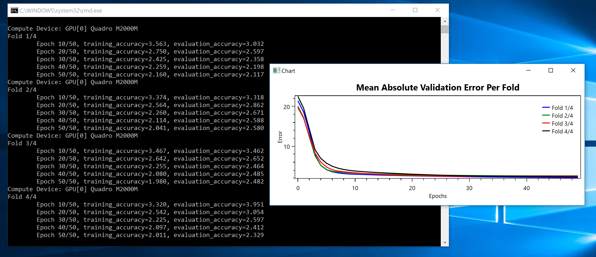

# Predicting Housing Prices

The original Python code can be found in [ch3-7.py](../../Python/ch3-7.py)

This is a regression problem, which uses mean squared error as the loss
function, and introduces KFold training. 

We'll need to do 4 things:

1. Load the data
2. Create the Network, and write the custom loss/evaluation functions
3. Train the Network with KFold partitioning
4. Plot the Evaluation Accuracy per fold

### Loading the Data

Loading the data is, by now, straightforward. We only need
to pay attention to the dimensions of the underlying 2D matrices.
```
void load_data() {
  if (!System.IO.File.Exists("x_train.bin")) {
    System.IO.Compression.ZipFile.ExtractToDirectory("house_prices.zip", ".");
  }
  x_train = Util.load_binary_file("x_train.bin", 404, 13);
  y_train = Util.load_binary_file("y_train.bin", 404);
  x_test = Util.load_binary_file("x_test.bin", 102, 13);
  y_test = Util.load_binary_file("y_test.bin", 102);

  Console.WriteLine("Done with loading data\n");
}
```

### Neural Network and Custom Loss Functions

The Keras code construcs a model with 3 Fully Connected layers,
uses `mse` (mean squared error) and `mae` (mean absolute error)
as the loss/accuracy functions respectively. 

```
def build_model(input_dim):
    model = keras.models.Sequential()
    model.add(keras.layers.Dense(64, activation='relu', input_shape=(input_dim,)))
    model.add(keras.layers.Dense(64, activation='relu'))
    model.add(keras.layers.Dense(1))
    model.compile(optimizer='rmsprop', loss='mse', metrics=['mae'])
    return model
```

In CNTK and C# it is straightforward to define the two custom functions

```
static public CNTK.Function MeanSquaredError(CNTK.Variable prediction, CNTK.Variable labels) {
  var squared_errors = CNTK.CNTKLib.Square(CNTK.CNTKLib.Minus(prediction, labels));
  var result = CNTK.CNTKLib.ReduceMean(squared_errors, new CNTK.Axis(0));
  return result;
}

static public CNTK.Function MeanAbsoluteError(CNTK.Variable prediction, CNTK.Variable labels) {
  var absolute_errors = CNTK.CNTKLib.Abs(CNTK.CNTKLib.Minus(prediction, labels));
  var result = CNTK.CNTKLib.ReduceMean(absolute_errors, new CNTK.Axis(0));
  return result;
}
```

With these two methods in place, the network is constructed as follows
```
void create_network() {
  computeDevice = Util.get_compute_device();
  Console.WriteLine("Compute Device: " + computeDevice.AsString());

  x_tensor = CNTK.Variable.InputVariable(CNTK.NDShape.CreateNDShape(new int[] { 13 }), CNTK.DataType.Float);
  y_tensor = CNTK.Variable.InputVariable(CNTK.NDShape.CreateNDShape(new int[] { 1 }), CNTK.DataType.Float);

  network = CNTK.CNTKLib.ReLU(Util.Dense(x_tensor, 64, computeDevice));
  network = CNTK.CNTKLib.ReLU(Util.Dense(network, 64, computeDevice));
  network = Util.Dense(network, 1, computeDevice);

  loss_function = Util.MeanSquaredError(network.Output, y_tensor);
  accuracy_function = Util.MeanAbsoluteError(network.Output, y_tensor);

  var parameterVector = new CNTK.ParameterVector((System.Collections.ICollection)network.Parameters());
  var learner = CNTK.CNTKLib.AdamLearner(parameterVector, new CNTK.TrainingParameterScheduleDouble(0.001, 1), new CNTK.TrainingParameterScheduleDouble(0.9, 1), true);
  trainer = CNTK.CNTKLib.CreateTrainer(network, loss_function, accuracy_function, new CNTK.LearnerVector() { learner });
  evaluator = CNTK.CNTKLib.CreateEvaluator(accuracy_function);
}
```

### Network training using KFold Partitioning

The Keras code divides the training indices into 4 non-overlapping sets, 
uses one for validation, and the other 3 for training. 
```
k = 4
num_val_samples = len(x_train) // k
num_epochs = 20
all_scores = list()
all_mae_histories = list()
for i in range(k):
    print('processing fold #', i)
    # Prepare the validation data: data from partition # k
    val_data = x_train[i * num_val_samples: (i + 1) * num_val_samples]
    val_targets = y_train[i * num_val_samples: (i + 1) * num_val_samples]

    # Prepare the training data: data from all other partitions
    partial_train_data = np.concatenate([x_train[:i * num_val_samples], x_train[(i + 1) * num_val_samples:]], axis=0)
    partial_train_targets = np.concatenate([y_train[:i * num_val_samples], y_train[(i + 1) * num_val_samples:]], axis=0)

    model = build_model(x_train.shape[1])
    history = model.fit(partial_train_data, partial_train_targets, epochs=num_epochs, validation_data=(val_data, val_targets), batch_size=16)
    all_mae_histories.append(history.history['val_mean_absolute_error'])

average_mae_history = [np.mean([x[i] for x in all_mae_histories]) for i in range(num_epochs)]
```

In C#, we only need to play a trick with LINQ, and achieve a similar partitioning
```
var val_indices = Enumerable.Range(fold_index * num_val_samples, num_val_samples).ToArray();
var training_indices_part_one = Enumerable.Range(0, fold_index * num_val_samples).ToList();
var training_indices_part_two = Enumerable.Range((fold_index + 1) * num_val_samples, x_train.Length - (fold_index + 1) * num_val_samples).ToList();
var training_indices = training_indices_part_one.Concat(training_indices_part_two).ToArray();
Util.shuffle(training_indices);
```

Then, for both training and evaluation, we need to pass the corresponding
indices as arguments. For example, the `evaluation_phase` becomes
```
double evaluation_phase(int[] validation_indices) {
  var pos = 0;
  var num_batches = 0;
  var epoch_evaluation_accuracy = 0.0;
  while (pos < validation_indices.Length) {
    var pos_end = Math.Min(pos + batch_size, validation_indices.Length);
    var minibatch_x = Util.get_tensors(x_tensor.Shape, x_train, validation_indices, pos, pos_end, computeDevice);
    var minibatch_y = Util.get_tensors(y_tensor.Shape, y_train, validation_indices, pos, pos_end, computeDevice);
    var feed_dictionary = new test_feed_t() { { x_tensor, minibatch_x }, { y_tensor, minibatch_y } };
    var minibatch_accuracy = evaluator.TestMinibatch(feed_dictionary, computeDevice);
    epoch_evaluation_accuracy += minibatch_accuracy;
    num_batches++;
    pos = pos_end;
  }
  epoch_evaluation_accuracy /= num_batches;
  return epoch_evaluation_accuracy;
}
```

### Plotting the Mean Absolute Validation Error Per Fold

Once the training is complete, we fire up a WPF window with an OxyPlot chart in it.  
```
public PlotWindow(List<List<double>> results) {
  var plotModel = new OxyPlot.PlotModel();
  plotModel.Title = "Mean Absolute Validation Error Per Fold";

  plotModel.Axes.Add(new OxyPlot.Axes.LinearAxis() { Position = OxyPlot.Axes.AxisPosition.Left, Title = "Error" });
  plotModel.Axes.Add(new OxyPlot.Axes.LinearAxis() { Position = OxyPlot.Axes.AxisPosition.Bottom, Title = "Epochs" });

  var colors = new OxyPlot.OxyColor[] { OxyPlot.OxyColors.Blue, OxyPlot.OxyColors.Green, OxyPlot.OxyColors.Red, OxyPlot.OxyColors.Black };
  for (int row = 0; row < results.Count; row++) {
    var lineSeries = new OxyPlot.Series.LineSeries();
    lineSeries.ItemsSource = results[row].Select((value, index) => new OxyPlot.DataPoint(index, value));
    lineSeries.Title = string.Format("Fold {0}/{1}", row + 1, results.Count);
    lineSeries.Color = colors[row];
    plotModel.Series.Add(lineSeries);
  }

  var plotView = new OxyPlot.Wpf.PlotView();
  plotView.Model = plotModel;

  Title = "Chart";
  Content = plotView;
}
```

### Wrapping up

This is a very small data set, and the training is done very fast. 
Here's how it looks like. 

