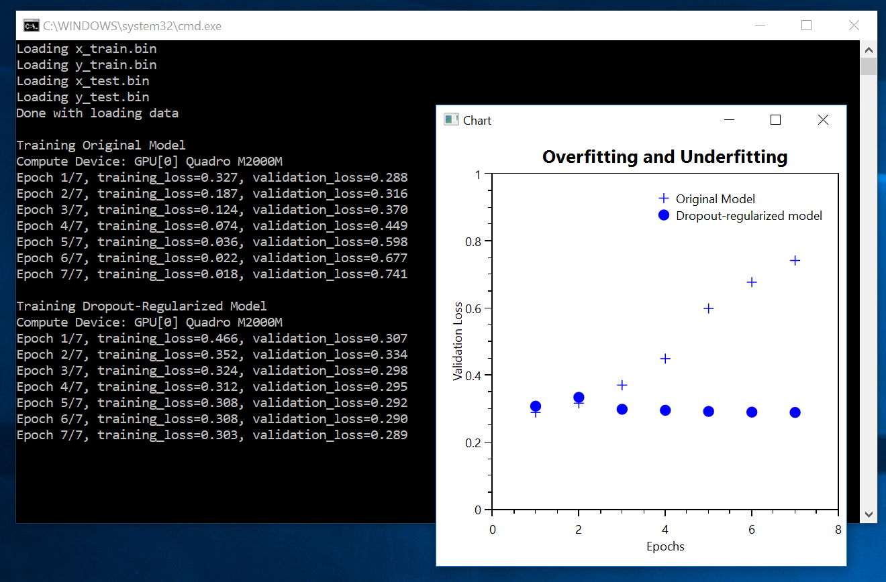

# Overfitting and Underfitting

The original Python code can be found in [ch4-4.py](../../Python/ch4-4.py)
 
We start from the model we used in [Ch_03_Classifying_Movie_Reviews](../Ch_03_Classifying_Movie_Reviews), and we
add Regularization and Dropout as way to reduce overfitting.
 
In Keras, Regularization can be added in a single line.
```
# L1 and L2 regularization at the same time
keras.regularizers.l1_l2(l1=0.001, l2=0.001)
```
 
In CNTK, Regularization is specified as an additional argument when we create a `CNTK.Learner`
```
var learningOptions = new CNTK.AdditionalLearningOptions() {
  l1RegularizationWeight = 0.001,
  l2RegularizationWeight = 0.001
};
```

Regarding adding a Dropout layer, it is very simple to do so both in Keras and CNTK.

For completeness, here's how the method `create_network` looks like in C# 
```
void create_network(bool regularize=false, bool add_dropout=false) {
  computeDevice = Util.get_compute_device();
  Console.WriteLine("Compute Device: " + computeDevice.AsString());

  x_tensor = CNTK.Variable.InputVariable(CNTK.NDShape.CreateNDShape(new int[] { 10000 }), CNTK.DataType.Float);
  y_tensor = CNTK.Variable.InputVariable(CNTK.NDShape.CreateNDShape(new int[] { 1 }), CNTK.DataType.Float);

  network = CNTK.CNTKLib.ReLU(Util.Dense(x_tensor, 16, computeDevice));
  if ( add_dropout ) {
    network = CNTK.CNTKLib.Dropout(network, 0.5);
  }
  network = CNTK.CNTKLib.ReLU(Util.Dense(network, 16, computeDevice));
  if (add_dropout) {
    network = CNTK.CNTKLib.Dropout(network, 0.5);
  }
  network = CNTK.CNTKLib.Sigmoid(Util.Dense(network, 1, computeDevice));

  loss_function = CNTK.CNTKLib.BinaryCrossEntropy(network.Output, y_tensor);
  accuracy_function = loss_function;

  var learningOptions = new CNTK.AdditionalLearningOptions() {
    l1RegularizationWeight = regularize ? 0.001 : 0,
    l2RegularizationWeight = regularize ? 0.001 : 0
  };

  var learner = CNTK.CNTKLib.AdamLearner(
    parameters: new CNTK.ParameterVector((System.Collections.ICollection)network.Parameters()),
    learningRateSchedule: new CNTK.TrainingParameterScheduleDouble(0.001, 1), 
    momentumSchedule: new CNTK.TrainingParameterScheduleDouble(0.9, 1), 
    unitGain: true, 
    varianceMomentumSchedule: new CNTK.TrainingParameterScheduleDouble(0.9999986111120757, 1),
    epsilon: 1e-8,
    adamax: false,
    additionalOptions: learningOptions);

  trainer = CNTK.CNTKLib.CreateTrainer(
    network, 
    loss_function, 
    accuracy_function, 
    new CNTK.LearnerVector() { learner });

  evaluator = CNTK.CNTKLib.CreateEvaluator(accuracy_function);
}
```
 
We create and train the network two times: with/without regularization+dropout. 
```
List<List<double>> train_network() {
  Console.WriteLine("Training Original Model");
  var original_model_validation_loss = train_network(regularize: false, add_dropout: false);

  Console.WriteLine("\nTraining Dropout-Regularized Model");
  var dropout_regularized_validation_loss = train_network(regularize: true, add_dropout: true);

  return new List<List<double>> { original_model_validation_loss, dropout_regularized_validation_loss };
}
```

Finally, we use OxyPlot to plot the validation loss. 


