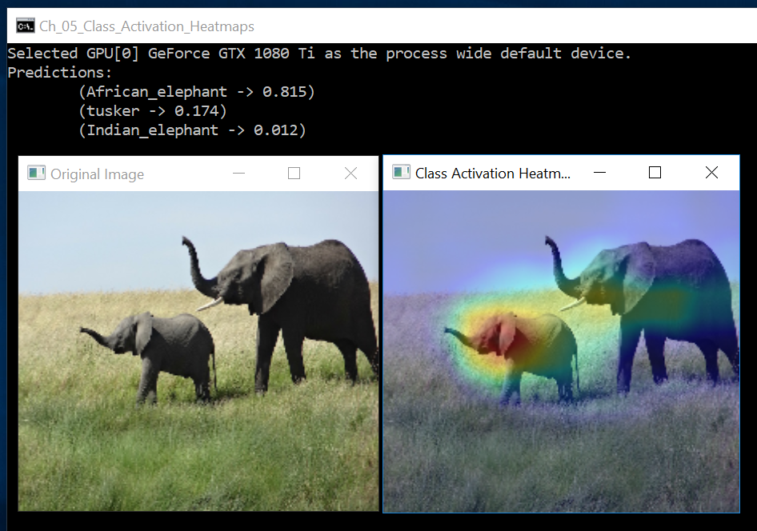

# Class Activation HeatMaps

The original Python code can be found in the function `visualizing_heatmaps_of_class_activation` in  [ch5-4.py](../../Python/ch5-4.py)

As in the previous example, we need to compute gradients at an intermediate layer. 

As of CNTK 2.4, this is not supported in C#, and we'll need to resort to C++ and P/Invoke to get to this functionality. 
This is done in the function `visualize_heatmap` in [CPPUtil.cpp](../CPPUtil/CPPUtil.cpp)

Instead of describing the C++ code, let's go briefly over the C# part.

First, we load the ImageNet class information from the file 'imagenet_class_index.json'
```
{"0": ["n01440764", "tench"], 
"1": ["n01443537", "goldfish"], 
"2": ["n01484850", "great_white_shark"], 
"3": ["n01491361", "tiger_shark"], 
"4": ["n01494475", "hammerhead"],
... 
``` 

Next, we pass the original image though the (pre-trained) VGG16, 
and show the top 3 predictions 

```
int num_classes = 1000;
var predictions = new float[num_classes];
CPPUtil.evaluate_vgg16(pathToVGG16model, imagePath, predictions, num_classes);

var indices = Enumerable.Range(0, num_classes).ToArray<int>();
var floatComparer = Comparer<float>.Default;
Array.Sort(indices, (a, b) => floatComparer.Compare(predictions[b], predictions[a]));

Console.WriteLine("Predictions:");
for (int i=0; i<3; i++) {
  var imagenetClass = imagenetInfo[indices[i]];
  var imagenetClassName = imagenetClass[1];
  var predicted_score = predictions[indices[i]];
  Console.WriteLine($"\t({imagenetClassName} -> {predicted_score:f3})");
}
```

It turns out that the top prediction is "African Elephant" which corresponds to index 386 of the final VGG16 1000x1 output vector.   

To generate the heatmap based on the output of the "conv5_3" layer (which is the last convolution layer), we'll use: 

```
  var imageWithHeatMap = new float[image.Length];
  CPPUtil.visualize_heatmap(pathToVGG16model, imagePath, "conv5_3", 386, imageWithHeatMap);
```

Finally, we obtain: 

