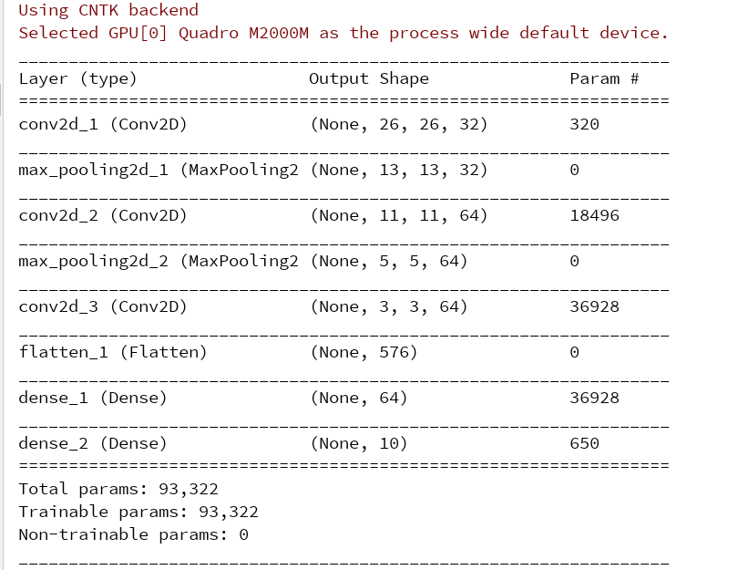
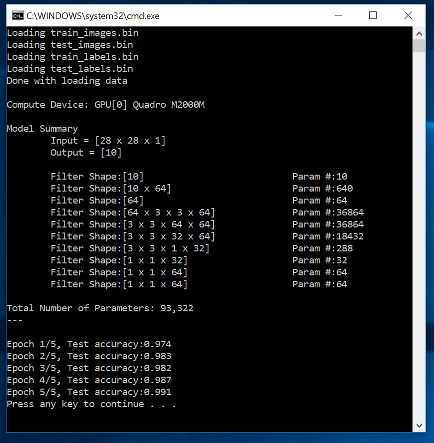

# Introduction to Convnets

The original Python code can be found in [ch5-1.py](../../Python/ch5-1.py)

The Keras code for the creation of the network is
```
model = keras.models.Sequential()
model.add(keras.layers.Conv2D(32, (3, 3), activation='relu', input_shape=(28, 28, 1)))
model.add(keras.layers.MaxPooling2D((2, 2)))
model.add(keras.layers.Conv2D(64, (3, 3), activation='relu'))
model.add(keras.layers.MaxPooling2D((2, 2)))
model.add(keras.layers.Conv2D(64, (3, 3), activation='relu'))
model.add(keras.layers.Flatten())
model.add(keras.layers.Dense(64, activation='relu'))
model.add(keras.layers.Dense(10, activation='softmax'))
```

In C#, the code to create the network is
```
image_tensor = CNTK.Variable.InputVariable(CNTK.NDShape.CreateNDShape(new int[] { 28, 28, 1 }), CNTK.DataType.Float);
label_tensor = CNTK.Variable.InputVariable(CNTK.NDShape.CreateNDShape(new int[] { 10 }), CNTK.DataType.Float);

network = image_tensor;
network = Util.Convolution2DWithReLU(network, 32, new int[] { 3, 3 }, computeDevice);
network = CNTK.CNTKLib.Pooling(network, CNTK.PoolingType.Max, new int[] { 2, 2 }, new int[] { 2 });
network = Util.Convolution2DWithReLU(network, 64, new int[] { 3, 3 }, computeDevice);
network = CNTK.CNTKLib.Pooling(network, CNTK.PoolingType.Max, new int[] { 2, 2 }, new int[] { 2 });
network = Util.Convolution2DWithReLU(network, 64, new int[] { 3, 3 }, computeDevice);
network = Util.Dense(network, 64, computeDevice);
network = CNTK.CNTKLib.ReLU(network);
network = Util.Dense(network, 10, computeDevice);
``` 

Three things to pay attention to 

1. The shape of the input tensor is now 28x28x1 (instead of 28x28 that we had previously).
2. CNTK does not need a `Flatten()` layer
3. Although CNTK provides simple wrapper methods in Python, in C# we need to write out helper methods `Util.Convolution2DWithRelu` and `Util.Dense`.  

Finally, let's verify that we have actually constructed the same network. 

In Keras `model.summary()` produces



Here's what we get with C# 




Tears of joy. 