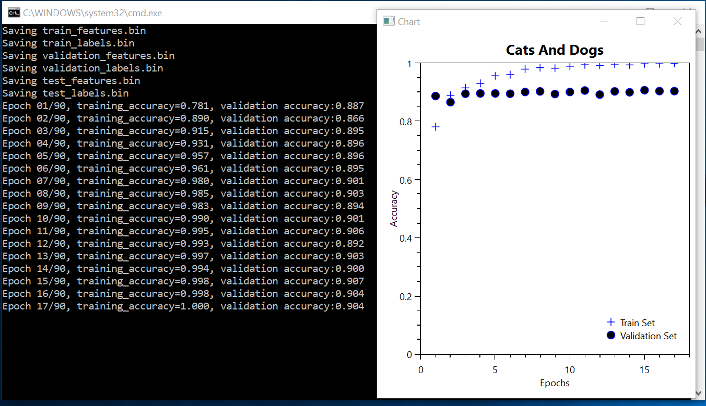
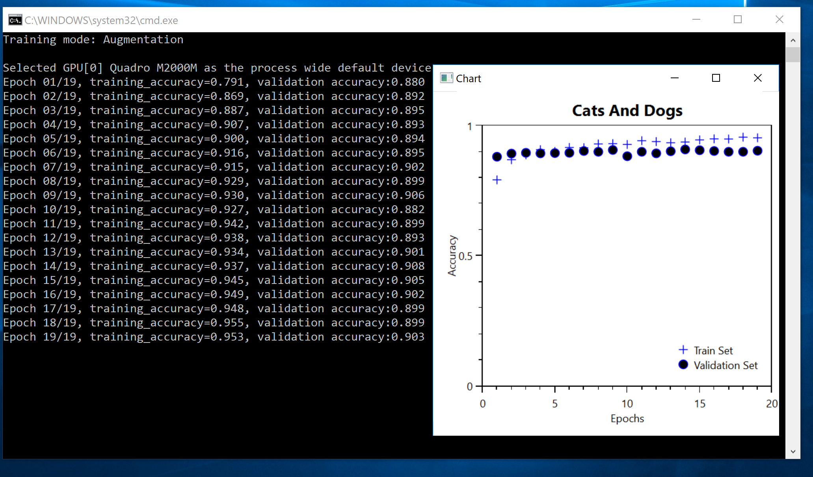
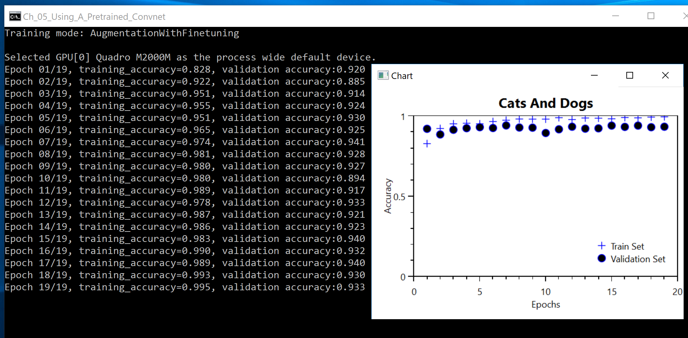

# Using A Pretrained Convnet

The original Python code can be found in [ch5-3.py](../../Python/ch5-3.py)

If you haven't read it yet, please go over [Chapter 5.3](http://nbviewer.jupyter.org/github/fchollet/deep-learning-with-python-notebooks/blob/master/5.3-using-a-pretrained-convnet.ipynb) -- we'll not repeat the material here. Instead, we'll focus on the C# port.

This is going to be a long adventure, grab a cup of coffee.  

## Extracting the VGG16 Bottleneck Features

The Keras code that extracts the features is: 
```
def extract_features(directory, sample_count):
    conv_base = keras.applications.VGG16(weights='imagenet', include_top=False, input_shape=(150, 150, 3))
    conv_base.summary()

    datagen = keras.preprocessing.image.ImageDataGenerator(rescale=1. / 255)
    batch_size = 20

    features = np.zeros(shape=(sample_count, 4, 4, 512))
    labels = np.zeros(shape=(sample_count))
    generator = datagen.flow_from_directory(
        directory,
        target_size=(150, 150),
        batch_size=batch_size,
        class_mode='binary')
    i = 0
    for inputs_batch, labels_batch in generator:
        features_batch = conv_base.predict(inputs_batch)
        features[i * batch_size : (i + 1) * batch_size] = features_batch
        labels[i * batch_size : (i + 1) * batch_size] = labels_batch
        i += 1
        if i % 4 == 0:
            print('{0}, processed {1} images'.format(directory, i*batch_size))
        if i * batch_size >= sample_count:
            break
    return features, labels
``` 

The corresponding C# code is:
```
    Tuple<float[][], float[][]> extract_features(int start_index, int sample_count, string prefix) {
      var extracted_features = new float[2*sample_count][];
      var extracted_labels = new float[extracted_features.Length][];
      
      var labels = CNTK.Variable.InputVariable(new int[] { 2 }, CNTK.DataType.Float, "labels");
      var features = CNTK.Variable.InputVariable(new int[] { 150, 150, 3 }, CNTK.DataType.Float, "features");
      var scalar_factor = CNTK.Constant.Scalar<float>((float)(1.0 / 255.0), computeDevice);
      var scaled_features = CNTK.CNTKLib.ElementTimes(scalar_factor, features);

      var conv_base = VGG16.get_model(scaled_features, computeDevice);
      //Util.PredorderTraverse(conv_base);

      var minibatch_source = create_minibatch_source(features.Shape, start_index, sample_count, prefix);
      var features_stream_info = minibatch_source.StreamInfo("features");
      var labels_stream_info = minibatch_source.StreamInfo("labels");
      var pos = 0;
      while (pos < extracted_features.Length) {
        var pos_end = Math.Min(pos + batch_size, extracted_features.Length);
        var data = minibatch_source.GetNextMinibatch((uint)(pos_end - pos), computeDevice);

        var input_d = new Dictionary<CNTK.Variable, CNTK.Value>() { { features, data[features_stream_info].data } };
        var output_d = new Dictionary<CNTK.Variable, CNTK.Value>() { { conv_base.Output, null } };
        conv_base.Evaluate(input_d, output_d, computeDevice);

        var minibatch_extracted_features = output_d[conv_base.Output].GetDenseData<float>(conv_base.Output);
        for (int i = 0; i < data[features_stream_info].numberOfSamples; i++) {
          extracted_features[pos + i] = minibatch_extracted_features[i].ToArray();
          extracted_labels[pos+i] = new float[2];
          extracted_labels[pos + i][i % 2] = 1;
        }
        pos = pos_end;
      }
      
      return Tuple.Create(extracted_features, extracted_labels);
    }
``` 

Let's go step-by-step. 

### Pre-trained VGG16

The first thing that we need to do is load the pre-trained VGG16 model. This is handled by the helper method `VGG16.get_model`

```
    static public CNTK.Function get_model(CNTK.Variable features, CNTK.DeviceDescriptor computeDevice, bool allow_block5_finetuning=false) {
      // load the original VGG16 model
      download_model_if_needed();
      var model = CNTK.Function.Load(fullpath, computeDevice);

      // get the last VGG16 layer before the first fully connected layer
      var last_frozen_layer = model.FindByName(allow_block5_finetuning ? "pool4" : "pool5");

      // get the first layer, and the "data" input variable
      var conv1_1_layer = model.FindByName("conv1_1");
      var data = conv1_1_layer.Inputs.First((v) => v.Name == "data");

      // the data should be a 224x224x3 input tensor
      if (!data.Shape.Dimensions.SequenceEqual(new int[] { 224, 224, 3 })) {
        System.Console.WriteLine("There's a problem here. Please email");
        System.Environment.Exit(2);
      }

      // allow different dimensions for input (e.g., 150x150x3)
      var replacements = new System.Collections.Generic.Dictionary<CNTK.Variable, CNTK.Variable>() { { data, features } };

      // clone the original VGG16 model up to the pool_node, freeze all weights, and use a custom input tensor
      var frozen_model = CNTK.CNTKLib
        .Combine(new CNTK.VariableVector() { last_frozen_layer.Output })
        .Clone(CNTK.ParameterCloningMethod.Freeze, replacements);

      if ( !allow_block5_finetuning ) { return frozen_model; }

      var pool5_layer = model.FindByName("pool5");
      replacements = new System.Collections.Generic.Dictionary<CNTK.Variable, CNTK.Variable>() { { last_frozen_layer.Output, frozen_model.Output} };

      var model_with_finetuning = CNTK.CNTKLib
        .Combine(new CNTK.VariableVector() { pool5_layer.Output })
        .Clone(CNTK.ParameterCloningMethod.Clone, replacements);

      return model_with_finetuning;
    }
```

This method is doing two things: first, it downloads from https://www.cntk.ai/Models/Caffe_Converted/VGG16_ImageNet_Caffe.model 
a pretrained VGG16 model. 

Second, unless we are doing fine-tuning, it chops it off at `pool5` layer, it freezes the remaining weights, and returns the model 
(for the fine-tuning case, scroll all the way down to the end).  

## Using the frozen VGG16 model

Once we have the frozen VGG16 model, we'll feed into it the
Cats and Dogs images. This is effectively done in 
```
  while (pos < extracted_features.Length) {
    var pos_end = Math.Min(pos + batch_size, extracted_features.Length);
    var data = minibatch_source.GetNextMinibatch((uint)(pos_end - pos), computeDevice);

    var input_d = new Dictionary<CNTK.Variable, CNTK.Value>() { { features, data[features_stream_info].data } };
    var output_d = new Dictionary<CNTK.Variable, CNTK.Value>() { { conv_base.Output, null } };
    conv_base.Evaluate(input_d, output_d, computeDevice);

    var minibatch_extracted_features = output_d[conv_base.Output].GetDenseData<float>(conv_base.Output);
    for (int i = 0; i < data[features_stream_info].numberOfSamples; i++) {
      extracted_features[pos + i] = minibatch_extracted_features[i].ToArray();
      extracted_labels[pos+i] = new float[2];
      extracted_labels[pos + i][i % 2] = 1;
    }
    pos = pos_end;
  }
```

Once this is done, the extracted features/labels are saved into temporary
files so that we don't have to do this all the time. This is done in the 2nd
part of the method `compute_features_and_labels`

```
var extracted_info = extract_features(0, 2000, "all");
var all_features = extracted_info.Item1;
var all_labels = extracted_info.Item2;

train_features = new float[2000][];
train_labels = new float[2000][];
Array.Copy(all_features, train_features, 2000);
Array.Copy(all_labels, train_labels, 2000);
Util.save_binary_file(train_features, "train_features.bin");
Util.save_binary_file(train_labels, "train_labels.bin");

validation_features = new float[1000][];
validation_labels = new float[1000][];
Array.Copy(all_features, 2000, validation_features, 0, 1000);
Array.Copy(all_labels, 2000, validation_labels, 0, 1000);
Util.save_binary_file(validation_features, "validation_features.bin");
Util.save_binary_file(validation_labels, "validation_labels.bin");

test_features = new float[1000][];
test_labels = new float[1000][];
Array.Copy(all_features, 3000, test_features, 0, 1000);
Array.Copy(all_labels, 3000, test_labels, 0, 1000);
Util.save_binary_file(test_features, "test_features.bin");
Util.save_binary_file(test_labels, "test_labels.bin");
```

## Training with the Extracted Features

The Python code for training with the extracted features we generated
in the previous step is:

```
def train_with_extracted_features():
    if os.path.isfile('test_features.npy'):
        train_features, train_labels = load_npy_files('train')
        validation_features, validation_labels = load_npy_files('validation')
        test_features, test_labels = load_npy_files('test')
    else:
        train_features, train_labels = extract_features(train_dir, 2000)
        validation_features, validation_labels = extract_features(validation_dir, 1000)
        test_features, test_labels = extract_features(test_dir, 1000)

        train_features = np.reshape(train_features, (2000, 4 * 4 * 512))
        validation_features = np.reshape(validation_features, (1000, 4 * 4 * 512))
        test_features = np.reshape(test_features, (1000, 4 * 4 * 512))

        save_npy_files(train_features, train_labels, 'train')
        save_npy_files(validation_features, validation_labels, 'validation')
        save_npy_files(test_features, test_labels, 'test')

    model = keras.models.Sequential()
    model.add(keras.layers.Dense(256, activation='relu', input_dim=4 * 4 * 512))
    model.add(keras.layers.Dropout(0.5))
    model.add(keras.layers.Dense(1, activation='sigmoid'))
    model.compile(optimizer=keras.optimizers.RMSprop(lr=2e-5), loss='binary_crossentropy', metrics=['acc'])

    history = model.fit(train_features, train_labels, epochs=5, batch_size=20, validation_data=(validation_features, validation_labels))
    plot_history(history)
```

We have a two-layer Fully-Connected network, with an intermediate Dropout layer. 

In C#, in the method `train_with_extracted_features`, first we define the 
network in a similar manner:

```
var labels = CNTK.Variable.InputVariable(new int[] { 2, }, CNTK.DataType.Float, "labels_var");
var features = CNTK.Variable.InputVariable(new int[] { extracted_feature_length, }, CNTK.DataType.Float, "features_var");

var model = CNTK.CNTKLib.ReLU(Util.Dense(features, 256, computeDevice));
model = CNTK.CNTKLib.Dropout(model, 0.5);
model = Util.Dense(model, 2, computeDevice);

var loss_function = CNTK.CNTKLib.CrossEntropyWithSoftmax(model.Output, labels);
var accuracy_function = CNTK.CNTKLib.ClassificationError(model.Output, labels);

var pv = new CNTK.ParameterVector((System.Collections.ICollection)model.Parameters());
var learner = CNTK.CNTKLib.AdamLearner(pv, new CNTK.TrainingParameterScheduleDouble(0.0001, 1), new CNTK.TrainingParameterScheduleDouble(0.99, 1));
var trainer = CNTK.Trainer.CreateTrainer(model, loss_function, accuracy_function, new CNTK.Learner[] { learner });
var evaluator = CNTK.CNTKLib.CreateEvaluator(accuracy_function);
```

As in the previous examples, we'll need to 
be explicit regarding the training/evaluation phase: 
```
  for (int epoch = 0; epoch < max_epochs; epoch++) {

    // training phase
    var epoch_training_error = 0.0;
    var train_indices = Util.shuffled_indices(train_features.Length);
    var pos = 0;
    var num_batches = 0;
    while (pos < train_indices.Length) {
      var pos_end = Math.Min(pos + batch_size, train_indices.Length);
      var minibatch_images = Util.get_tensors(features.Shape, train_features, train_indices, pos, pos_end, computeDevice);
      var minibatch_labels = Util.get_tensors(labels.Shape, train_labels, train_indices, pos, pos_end, computeDevice);
      var feed_dictionary = new feed_t() { { features, minibatch_images }, { labels, minibatch_labels } };
      trainer.TrainMinibatch(feed_dictionary, false, computeDevice);
      epoch_training_error += trainer.PreviousMinibatchEvaluationAverage();
      num_batches++;
      pos = pos_end;
    }
    epoch_training_error /= num_batches;
    training_accuracy.Add(1.0-epoch_training_error);

    // evaluation phase
    var epoch_validation_error = 0.0;
    num_batches = 0;
    pos = 0;
    while (pos < validation_features.Length) {
      var pos_end = Math.Min(pos + batch_size, validation_features.Length);
      var minibatch_images = Util.get_tensors(features.Shape, validation_features, pos, pos_end, computeDevice);
      var minibatch_labels = Util.get_tensors(labels.Shape, validation_labels, pos, pos_end, computeDevice);
      var feed_dictionary = new test_feed_t() { { features, minibatch_images }, { labels, minibatch_labels } };
      epoch_validation_error += evaluator.TestMinibatch(feed_dictionary, computeDevice);
      pos = pos_end;
      num_batches++;
    }
    epoch_validation_error /= num_batches;
    validation_accuracy.Add(1.0-epoch_validation_error);

    Console.WriteLine($"Epoch {epoch + 1:D2}/{max_epochs}, training_accuracy={1.0-epoch_training_error:F3}, validation accuracy:{1-epoch_validation_error:F3}");

    if ( epoch_training_error<0.001 ) { break; }
  }

```

Finally, we'll use an OxyPlot chart defined in 

```
class PlotWindow : System.Windows.Window {

public PlotWindow(List<List<double>> results) {
  var plotModel = new OxyPlot.PlotModel();
  plotModel.Title = "Cats And Dogs";
  plotModel.LegendPosition = OxyPlot.LegendPosition.BottomRight;

  plotModel.Axes.Add(new OxyPlot.Axes.LinearAxis() {
    Position = OxyPlot.Axes.AxisPosition.Left,
    Title = "Accuracy",
    Minimum = 0,
    Maximum = 1,
  });
  plotModel.Axes.Add(new OxyPlot.Axes.LinearAxis() {
    Position = OxyPlot.Axes.AxisPosition.Bottom,
    Minimum = 0,
    Maximum = results[0].Count + 1,
    Title = "Epochs"
  });

  var labels = new string[] { "Train Set", "Validation Set" };
  var markerTypes = new OxyPlot.MarkerType[] { OxyPlot.MarkerType.Plus, OxyPlot.MarkerType.Circle };
  for (int row = 0; row < results.Count; row++) {
    var scatterSeries = new OxyPlot.Series.ScatterSeries() {
      MarkerType = markerTypes[row],
      MarkerStroke = OxyPlot.OxyColors.Blue,
      MarkerFill = OxyPlot.OxyColors.Black
    };
    scatterSeries.ItemsSource = results[row].Select((value, index) => new OxyPlot.Series.ScatterPoint(index + 1, value));
    scatterSeries.Title = labels[row];
    plotModel.Series.Add(scatterSeries);
  }

  var plotView = new OxyPlot.Wpf.PlotView();
  plotView.Model = plotModel;

  Title = "Chart";
  Content = plotView;
}
}

```
    


## Training With Augmentation

Now things will get fancy. We'll start from the pre-trained VGG16 model, chop off the top part, freeze the remaining weights, and then add on top our own layers. Then, we'll train it end-to-end with augmentation. 

The Keras code that constructs the model is

```
    conv_base = keras.applications.VGG16(weights='imagenet', include_top=False, input_shape=(150, 150, 3))
    conv_base.trainable = False

    model = keras.models.Sequential()
    model.add(conv_base)
    model.add(keras.layers.Flatten())
    model.add(keras.layers.Dense(256, activation='relu'))
    model.add(keras.layers.Dense(1, activation='sigmoid'))

    model.summary()

    print('This is the number of trainable weights before freezing the conv base:', len(model.trainable_weights))

```

In C#, the code looks quite similar. The base model is a frozen VGG16 model, and on top of it we'll add
some layers in the method `train_with_augmentation`:
```
var labels = CNTK.Variable.InputVariable(new int[] { 2 }, CNTK.DataType.Float, "labels");
var features = CNTK.Variable.InputVariable(new int[] { 150, 150, 3 }, CNTK.DataType.Float, "features");
var scalar_factor = CNTK.Constant.Scalar<float>((float)(1.0 / 255.0), computeDevice);
var scaled_features = CNTK.CNTKLib.ElementTimes(scalar_factor, features);

var conv_base = VGG16.get_model(scaled_features, computeDevice, use_finetuning);
var model = Util.Dense(conv_base, 256, computeDevice);
model = CNTK.CNTKLib.ReLU(model);
model = CNTK.CNTKLib.Dropout(model, 0.5);
model = Util.Dense(model, 2, computeDevice);
```

Once this is done, we proceed as we have done in the previous examples using the method `create_minibatch_source` to
enable on-the-fly random augmentations. The C# code looks like: 

```
CNTK.MinibatchSource create_minibatch_source(CNTK.NDShape shape, int start_index, int sample_count, string prefix, bool is_training=false, bool use_augmentations=false) {
  var map_filename = create_map_txt_file_if_needed(start_index, sample_count, prefix);

  var transforms = new List<CNTK.CNTKDictionary>();
  if (use_augmentations) {
    var randomSideTransform = CNTK.CNTKLib.ReaderCrop("RandomSide",
      new Tuple<int, int>(0, 0),
      new Tuple<float, float>(0.8f, 1.0f),
      new Tuple<float, float>(0.0f, 0.0f),
      new Tuple<float, float>(1.0f, 1.0f),
      "uniRatio");
    transforms.Add(randomSideTransform);
  }
  
  var scaleTransform = CNTK.CNTKLib.ReaderScale(width: shape[1], height: shape[0], channels: shape[2]);
  transforms.Add(scaleTransform);

  var imageDeserializer = CNTK.CNTKLib.ImageDeserializer(map_filename, "labels", 2, "features", transforms);
  var minibatchSourceConfig = new CNTK.MinibatchSourceConfig(new CNTK.DictionaryVector() { imageDeserializer });
  if ( !is_training ) {
    minibatchSourceConfig.randomizationWindowInChunks = 0;
    minibatchSourceConfig.randomizationWindowInSamples = 0;
  }
  return CNTK.CNTKLib.CreateCompositeMinibatchSource(minibatchSourceConfig);
}
``` 

Here's a sample run under `TrainingMode.Augmentation`



## FineTuning

In Keras, the property `.trainable` allows us to control whether a layer can be trained or not. 
So, to enable finetuning, all is needed is to make the layers from `block5_conv1` and higher trainable. 
```
 if use_finetuning:
        set_trainable = False
        for layer in conv_base.layers:
            if layer.name == 'block5_conv1':
                set_trainable = True
            if set_trainable:
                layer.trainable = True
            else:
                layer.trainable = False
    else:
        conv_base.trainable = False
```

In C#, the method `VGG16.get_model` takes as optional argument the flag `allow_block5_finetuning`. 
When the flag is true, then we use `CNTK.ParameterCloningMethod.Freeze` for the bottom part of
VGG16, and `CNTK.ParameterCloningMethod.Clone` for the layers that are above `pool4`. It looks like: 

```
  // clone the original VGG16 model up to the pool_node, freeze all weights, and use a custom input tensor
  var frozen_model = CNTK.CNTKLib
    .Combine(new CNTK.VariableVector() { last_frozen_layer.Output })
    .Clone(CNTK.ParameterCloningMethod.Freeze, replacements);

  if ( !allow_block5_finetuning ) { return frozen_model; }

  var pool5_layer = model.FindByName("pool5");
  replacements = new System.Collections.Generic.Dictionary<CNTK.Variable, CNTK.Variable>() { { last_frozen_layer.Output, frozen_model.Output} };

  var model_with_finetuning = CNTK.CNTKLib
    .Combine(new CNTK.VariableVector() { pool5_layer.Output })
    .Clone(CNTK.ParameterCloningMethod.Clone, replacements);
``` 

With this change, we proceed as before. Here's a sample run. 

