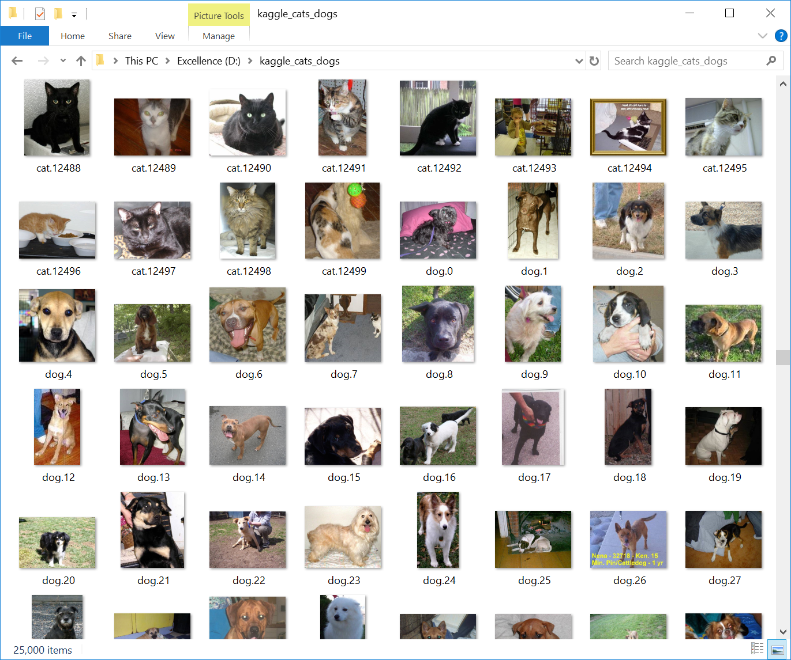
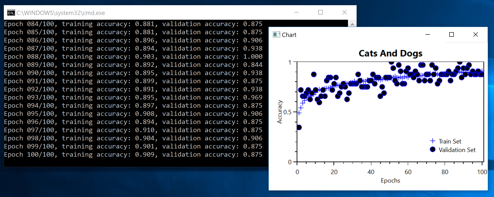

# Using Convnets with small Datasets

The original Python code can be found in [ch5-2.py](../../Python/ch5-2.py)

If you haven't read it yet, please go over [Chapter 5.2](http://nbviewer.jupyter.org/github/fchollet/deep-learning-with-python-notebooks/blob/master/5.2-using-convnets-with-small-datasets.ipynb) -- we'll not repeat the material here. Instead, we'll focus on the C# port. 
 
### Downloading the Data
 

The first thing that we need to do is to download the "cats and dogs" dataset, 
from [https://www.kaggle.com/c/dogs-vs-cats/data](https://www.kaggle.com/c/dogs-vs-cats/data).  You'll need a Kaggle account for this, but if you are reading this, most probably you already have one :-). 
 
Once you have downloaded the train.zip file, uncompress it, and it will look like 



### Loading and Augmenting the Data with a MinibatchSource

The Keras code uses an `ImageDataGenerator`. 
```
train_generator = train_datagen.flow_from_directory(
        # This is the target directory
        train_dir,
        # All images will be resized to 150x150
        target_size=(150, 150),
        batch_size=32,
        # Since we use binary_crossentropy loss, we need binary labels
        class_mode='binary')

validation_generator = test_datagen.flow_from_directory(
        validation_dir,
        target_size=(150, 150),
        batch_size=32,
        class_mode='binary')
```

With CNTK, we'll use a `MinibatchSource`. This is is done in the method 
```
CNTK.MinibatchSource create_minibatchSource(string map_file, int num_classes, bool train) {
  var transforms = new List<CNTK.CNTKDictionary>();
  if (true) {
    var randomSideTransform = CNTK.CNTKLib.ReaderCrop("RandomSide",
      new Tuple<int, int>(0, 0),
      new Tuple<float, float>(0.8f, 1.0f),
      new Tuple<float, float>(0.0f, 0.0f),
      new Tuple<float, float>(1.0f, 1.0f),
      "uniRatio");
    transforms.Add(randomSideTransform);
  }

  var scaleTransform = CNTK.CNTKLib.ReaderScale(image_width, image_height, num_channels);
  transforms.Add(scaleTransform);

  var imageDeserializer = CNTK.CNTKLib.ImageDeserializer(map_file, "labels", (uint)num_classes, "features", transforms);
  var minibatchSourceConfig = new CNTK.MinibatchSourceConfig(new CNTK.DictionaryVector() { imageDeserializer });
  return CNTK.CNTKLib.CreateCompositeMinibatchSource(minibatchSourceConfig);
}
```

Two things are worth pointing out: 

First, the `map_file` is created by the method `create_map_txt_files`, and it has a very simple two-column format. 
The first column is the full-path to the image, and the second column is the image class. 
For example, the first few entries of the `train_map.txt` look like: 
```
C:\Users\anastasios\Downloads\kagglecatsanddogs_3367a\PetImages\cat.0	0
C:\Users\anastasios\Downloads\kagglecatsanddogs_3367a\PetImages\dog.0	1
C:\Users\anastasios\Downloads\kagglecatsanddogs_3367a\PetImages\cat.1	0
C:\Users\anastasios\Downloads\kagglecatsanddogs_3367a\PetImages\dog.1	1
```

Second, we have used a
 
* `scaleTransform` to resize the images so that can be fed into a 150x150x3 features tensor,

* `randomSideTransform` to augment the input images

CNTK provides also other types of `ImageTransform`
 
 
### Creating the Network

The Keras code to build the network is: 
```
def build_network_with_dropout():
    model = keras.models.Sequential()
    model.add(keras.layers.Conv2D(32, (3, 3), activation='relu', input_shape=(150, 150, 3)))
    model.add(keras.layers.MaxPooling2D((2, 2)))
    model.add(keras.layers.Conv2D(64, (3, 3), activation='relu'))
    model.add(keras.layers.MaxPooling2D((2, 2)))
    model.add(keras.layers.Conv2D(128, (3, 3), activation='relu'))
    model.add(keras.layers.MaxPooling2D((2, 2)))
    model.add(keras.layers.Conv2D(128, (3, 3), activation='relu'))
    model.add(keras.layers.MaxPooling2D((2, 2)))
    model.add(keras.layers.Flatten())
    model.add(keras.layers.Dropout(0.5))
    model.add(keras.layers.Dense(512, activation='relu'))
    model.add(keras.layers.Dense(1, activation='sigmoid'))
    model.compile(loss='binary_crossentropy', optimizer=keras.optimizers.RMSprop(lr=1e-4), metrics=['acc'])
    return model
```

In C#, we have: 
```
    void create_network() {
      computeDevice = Util.get_compute_device();
      features_tensor = CNTK.Variable.InputVariable(new int[] { image_height, image_width, num_channels }, CNTK.DataType.Float);
      label_tensor = CNTK.Variable.InputVariable(new int[] { 2 }, CNTK.DataType.Float);

      var scalar_factor = CNTK.Constant.Scalar<float>((float)(1.0 / 255.0), computeDevice);
      network = CNTK.CNTKLib.ElementTimes(scalar_factor, features_tensor);

      network = Util.Convolution2DWithReLU(network, 32, new int[] { 3, 3 }, computeDevice);
      network = CNTK.CNTKLib.Pooling(network, CNTK.PoolingType.Max, new int[] { 2, 2 }, new int[] { 2 });
      network = Util.Convolution2DWithReLU(network, 64, new int[] { 3, 3 }, computeDevice);
      network = CNTK.CNTKLib.Pooling(network, CNTK.PoolingType.Max, new int[] { 2, 2 }, new int[] { 2 });
      network = Util.Convolution2DWithReLU(network, 128, new int[] { 3, 3 }, computeDevice);
      network = CNTK.CNTKLib.Pooling(network, CNTK.PoolingType.Max, new int[] { 2, 2 }, new int[] { 2 });
      network = Util.Convolution2DWithReLU(network, 128, new int[] { 3, 3 }, computeDevice);
      network = CNTK.CNTKLib.Pooling(network, CNTK.PoolingType.Max, new int[] { 2, 2 }, new int[] { 2 });
      network = CNTK.CNTKLib.Dropout(network, 0.5);
      network = CNTK.CNTKLib.ReLU(Util.Dense(network, 512, computeDevice));
      network = Util.Dense(network, 2, computeDevice);

      loss_function = CNTK.CNTKLib.CrossEntropyWithSoftmax(network.Output, label_tensor);
      accuracy_function = CNTK.CNTKLib.ClassificationError(network.Output, label_tensor);
      var parameterVector = new CNTK.ParameterVector((System.Collections.ICollection)network.Parameters());
      var learner = CNTK.CNTKLib.AdamLearner(parameterVector, new CNTK.TrainingParameterScheduleDouble(0.0001, 1), new CNTK.TrainingParameterScheduleDouble(0.99, 1));
      trainer = CNTK.CNTKLib.CreateTrainer(network, loss_function, accuracy_function, new CNTK.LearnerVector() { learner });
      evaluator = CNTK.CNTKLib.CreateEvaluator(accuracy_function);
    }
```

Note that the image pixel values are divided by 255 before they are fed into the network.

### Feeding the Data into the Network for training
The Keras code is only one line
```
history = model.fit_generator(
      train_generator,
      steps_per_epoch=100,
      epochs=100,
      validation_data=validation_generator,
      validation_steps=50)
```

With C#, we need to get the data from the `MinibatchSource` and feed them into the network for training. 

```
double train_phase(CNTK.MinibatchSource reader) {
  var featuresStreamInfo = reader.StreamInfo("features");
  var labelsStreamInfo = reader.StreamInfo("labels");
  var num_samples = 0;
  var num_minibatches = 0;
  var score = 0.0;
  while (num_samples < epoch_size) {
    num_minibatches++;
    var minibatchData = reader.GetNextMinibatch(minibatch_size, computeDevice);
    var arguments = new batch_t() { { features_tensor, minibatchData[featuresStreamInfo] }, { label_tensor, minibatchData[labelsStreamInfo] } };
    num_samples += (int)(minibatchData[featuresStreamInfo].numberOfSamples);
    trainer.TrainMinibatch(arguments, computeDevice);
    score += trainer.PreviousMinibatchEvaluationAverage();
  }
  var result = 1.0 - (score / num_minibatches);      
  return result;
}

```
 
### Plotting the Accuracy over the Training and the Validation Set. 

Once again, we'll fire up a WPF window with an OxyPlot chart. 


