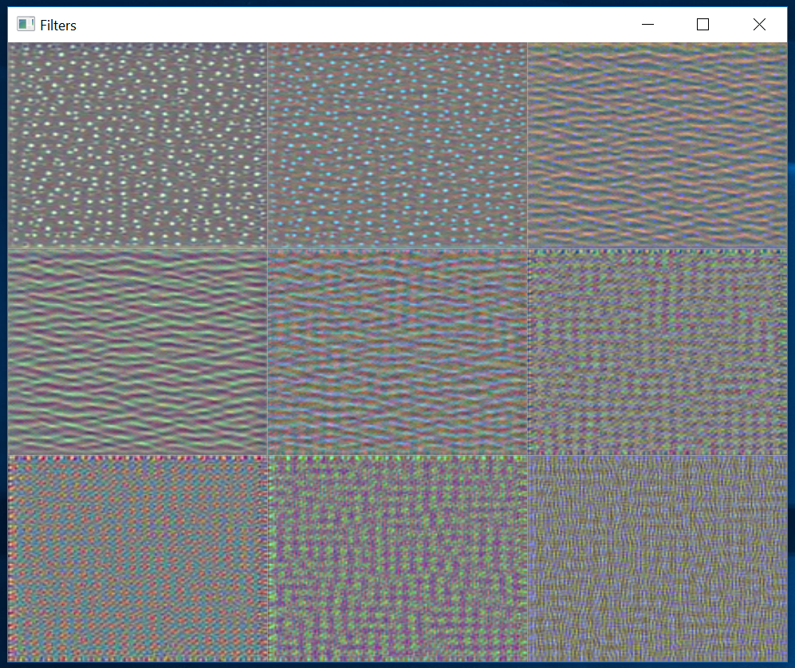

# Visualizing Convnet Filters

The original Python code can be found in the function `visualizing_convnet_filters` in  [ch5-4.py](../../Python/ch5-4.py)

As explained in the [write-up](https://github.com/fchollet/deep-learning-with-python-notebooks/blob/master/5.4-visualizing-what-convnets-learn.ipynb),
"_The process is simple: we will build a loss function 
that maximizes the value of a given filter in a given convolution layer, 
then we will use stochastic gradient descent to adjust the values of 
the input image so as to maximize this activation value._
"

The Keras code that computes the gradients with respect to an input image at
the 'block3_conv1' layer is:
```
model = keras.applications.VGG16(weights='imagenet', include_top=False)
model.summary()
layer_name = 'block3_conv1'
filter_index = 0
layer_output = model.get_layer(layer_name).output
loss = keras.backend.mean(layer_output[:, :, :, filter_index])
grads = keras.backend.gradients(loss, model.input)[0]
grads /= (keras.backend.sqrt(keras.backend.mean(keras.backend.square(grads))) + 1e-5)
iterate = keras.backend.function([model.input], [loss, grads])
loss_value, grads_value = iterate([np.zeros((1, 150, 150, 3))])
input_img_data = np.random.random((1, 150, 150, 3)) * 20 + 128.
# Run gradient ascent for 40 steps
step = 1.  # this is the magnitude of each gradient update
for i in range(40):
    # Compute the loss value and gradient value
    loss_value, grads_value = iterate([input_img_data])
    # Here we adjust the input image in the direction that maximizes the loss
    input_img_data += grads_value * step
``` 

Unfortunately, as of CNTK 2.4, in C# we don't have the ability to compute gradients. 

We'll need to resort to C++, and P/Invoke. 

Here's how the C++ code looks like.

```
void compute_image(float* image, const wchar_t* pathToVGG16model, int filterIndex) {
	auto computeDevice = get_compute_device();

	auto layer_name = L"conv3_1";
	CNTK::NDShape shape({ 150, 150, 3 });
	auto features = CNTK::InputVariable(shape, CNTK::DataType::Float, /*needs_gradient*/ true, L"features");
	auto scaled_features = CNTK::ElementTimes(CNTK::Constant::Scalar((float)(1.0 / 255.0), computeDevice), features);

	auto model = vgg16(pathToVGG16model, scaled_features, layer_name, computeDevice);

	auto filter_0 = CNTK::Slice(model, { CNTK::Axis(2) }, { filterIndex }, { filterIndex+1 });
	auto loss_function = CNTK::ReduceMean(filter_0, CNTK::Axis::AllStaticAxes(), L"loss_function");
	auto conv1_1_layer = model->FindByName(L"conv1_1");
	for (auto &v : conv1_1_layer->Inputs()) { if (v.Name() == L"features") { features = v; break; } }

	std::vector<float> input_img_data(features.Shape().TotalSize());
	for (auto& v : input_img_data) { v = (float(128 + 20.0 * (rand() / double(RAND_MAX)))); };

	auto step = 1.0;
	const int numSteps = 40;
	for (int i = 0; i < numSteps; i++) {
		std::wcout << "Step " << (i+1) << "/" << numSteps << std::endl;
		auto batch = CNTK::Value::CreateBatch(shape, input_img_data, computeDevice);
		dict_t arguments{ { features, batch } };
		dict_t gradients{ { features, nullptr } };
		loss_function->Gradients(arguments, gradients, computeDevice);

		std::vector<std::vector<float>> batchResults;
		gradients[features]->CopyVariableValueTo(features, batchResults);
		assert(batchResults.size() == 1);

		auto& results = batchResults[0];
		assert(results.size() == input_img_data.size());
		double sum_squares = 0.0;
		for (auto v : results) { sum_squares += v*v; }
		auto mean_sum_squares = sum_squares / double(results.size());
		auto normalization_factor = float(sqrt(mean_sum_squares));
		for (auto&v : results) { v /= normalization_factor; }
		for (std::size_t i = 0; i < results.size(); ++i) {
			input_img_data[i] += float(step * results[i]);
		}
	}
	memcpy(image, &input_img_data[0], shape.TotalSize() * sizeof(float));
}
``` 

We also need to add a function stub for the marshalling of data from C++ to C#

```
static public class CPPUtil {
  const string CPPUtilDll = "CPPUtil.dll";

  [DllImport(CPPUtilDll)]
  public static extern double version();

  [DllImport(CPPUtilDll)]
  public static extern void compute_image([In, Out]float[] image, [MarshalAs(UnmanagedType.LPWStr)]string pathToVGG16model, int filterIndex);

  [DllImport(CPPUtilDll)]
  public static extern void load_image([MarshalAs(UnmanagedType.LPWStr)]string imagePath, [In, Out]float[] image);

  [DllImport(CPPUtilDll)]
  public static extern void evaluate_vgg16([MarshalAs(UnmanagedType.LPWStr)]string pathToVGG16model, [MarshalAs(UnmanagedType.LPWStr)]string imagePath, [In, Out]float[] predictions, int num_classes);

  [DllImport(CPPUtilDll)]
  public static extern void visualize_heatmap(
    [MarshalAs(UnmanagedType.LPWStr)]string pathToVGG16model, 
    [MarshalAs(UnmanagedType.LPWStr)]string imagePath, 
    [MarshalAs(UnmanagedType.LPWStr)]string layerName, 
    int predictionIndex, 
    [In, Out]float[] imageWithOverlayedHitmap);
}

```

Eventually, we get the following patterns for the first 9 filters of "conv3_1"




