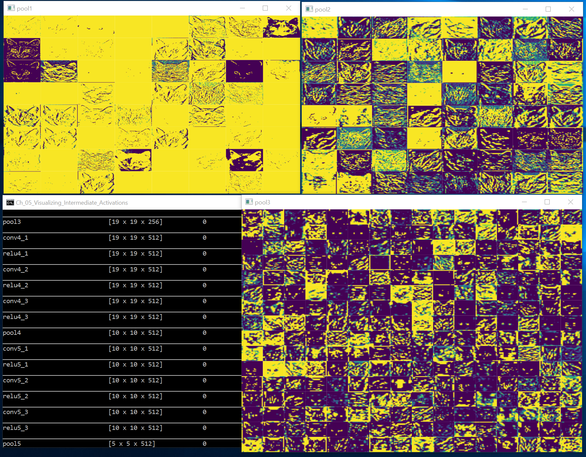

# Visualizing Intermediate Activations

The original Python code can be found in the function `visualizing_intermediate_activations` in  [ch5-4.py](../../Python/ch5-4.py)

Let's see how it is converted to C#. 

The first step is to load a pretrained VGG16 model. 

In Keras, this is done by doing: 
```
model = keras.applications.VGG16(weights='imagenet', include_top=False, input_shape=(150, 150, 3))
model.summary()
```  

The corresponding code in C# is: 
```
computeDevice = Util.get_compute_device();

var features = CNTK.Variable.InputVariable(new int[] { 150, 150, 3 }, CNTK.DataType.Float, "features");
var adjusted_features = CNTK.CNTKLib.Plus(CNTK.Constant.Scalar<float>((float)(-110), computeDevice), features, "adjusted features");

var scalar_factor = CNTK.Constant.Scalar<float>((float)(1.0 / 255.0), computeDevice);
var scaled_features = CNTK.CNTKLib.ElementTimes(scalar_factor, adjusted_features, "scaled features");
var base_model = VGG16.get_model(scaled_features, computeDevice);
Util.summary(base_model);
``` 

Once we have the model loaded, we need to 
focus on a layer of interest, and extract
the outputs at this layer. 

In Keras, this is done as follows:
 
```
layer_outputs = [layer.output for layer in model.layers[1:8]]
activation_model = keras.models.Model(inputs=model.input, outputs=layer_outputs)
activations = activation_model.predict(img_tensor)
```

In C#, we need to proceed on a layer-by-layer basis. 
```
var intermediate_node = base_model.FindByName(layer_names[i]);
var model = CNTK.CNTKLib.Combine(new CNTK.VariableVector() { intermediate_node.Output });

var image = load_image_in_channels_first_format(cat_filename, 150, 150);
var image_tensor = CNTK.Value.CreateBatch(features.Shape, image, computeDevice);

var input_d = new Dictionary<CNTK.Variable, CNTK.Value>() { { features, image_tensor } };
var output_d = new Dictionary<CNTK.Variable, CNTK.Value>() { { model.Output, null } };
model.Evaluate(input_d, output_d, computeDevice);

var outputValues = output_d[intermediate_node.Output].GetDenseData<float>(intermediate_node.Output);
var feature_height = intermediate_node.Output.Shape[0];
var feature_width = intermediate_node.Output.Shape[1];
var activations = outputValues[0].Take(num_entries[i] * feature_width * feature_height).ToArray();
```

Once we have the activations, we show them in a WPF grid.



Pretty cool!  

