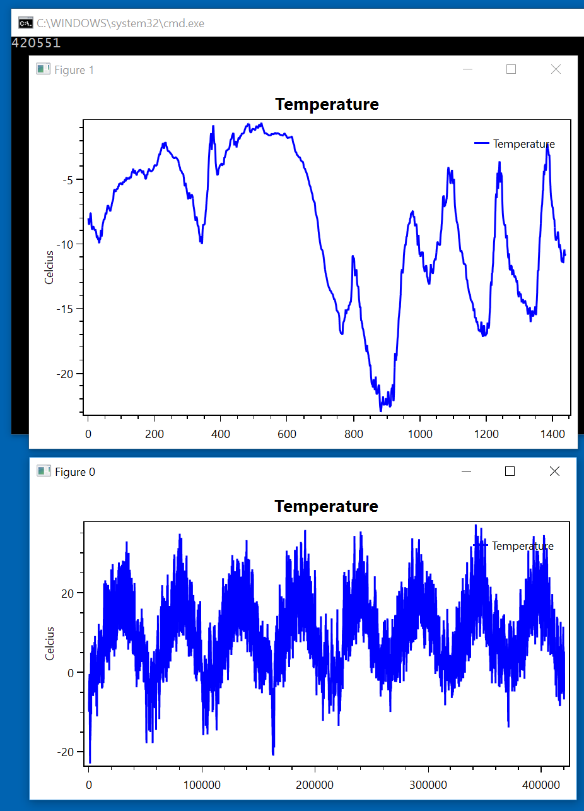
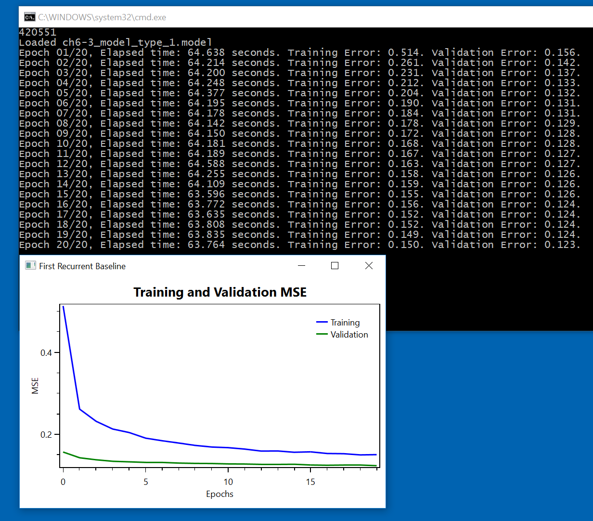
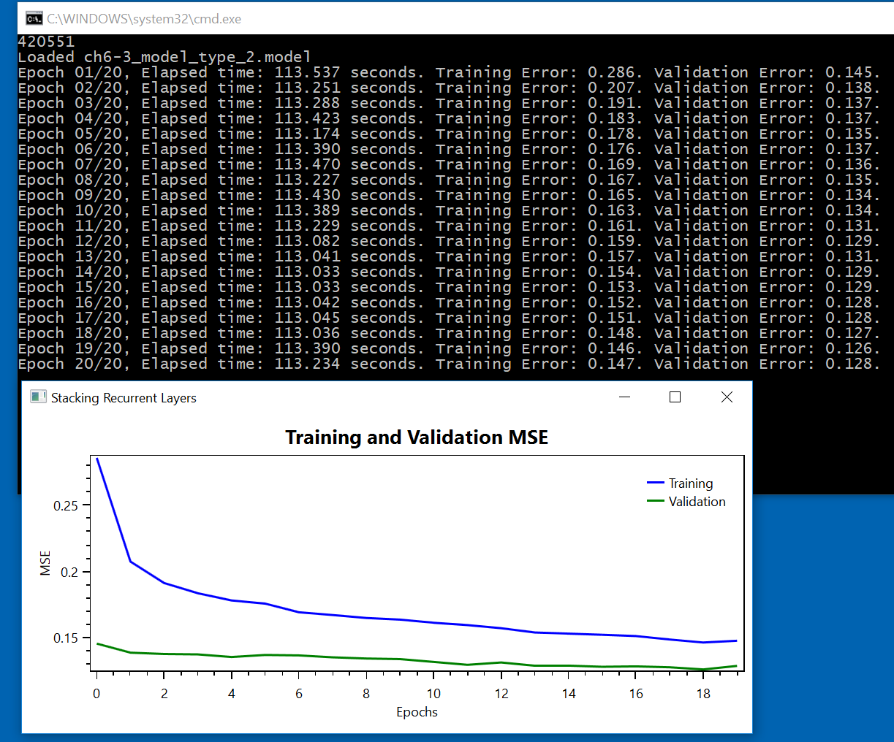

# Advanced Usage Of Recurrent Neural Networks

The original Python code can be found in [ch6-3.py](../../Python/ch6-3.py)

Now, we look at time series prediction, and in particular, temperature forecasting. 

Before we define the neural networks, we'll do 5 preparation steps

1. Download the data
2. Visualize the data
3. Normalize the data
4. Write the data generators
5. Write a C# version of the Keras `fit_generator`.

The first step is to download the measurements, extract the files, read them, and finally obtain 420,551 rows of data. 
```
List<string> download_and_read_lines() {
  System.Net.ServicePointManager.SecurityProtocol = System.Net.SecurityProtocolType.Tls12;
  var url_format = "https://www.bgc-jena.mpg.de/wetter/mpi_roof_{0}{1}.zip";
  var csv_filepaths = new List<string>();

  // step 1: download .zip files, and extract them to .csv files
  for (int year = 2009; year < 2017; year++) {
    foreach (var c in new char[] { 'a', 'b' }) {
      var url = String.Format(url_format, year, c);
      var zip_filepath = url.Split(new char[] { '/' }).Last();
      zip_filepath = Util.fullpathForDownloadedFile("roof_data", zip_filepath);
      var csv_filepath = zip_filepath.Replace(".zip", ".csv");
      if (System.IO.File.Exists(csv_filepath)) {
        csv_filepaths.Add(csv_filepath);
        continue;
      }
      if (System.IO.File.Exists(zip_filepath) == false) {
        var success = FromStackOverflow.FileDownloader.DownloadFile(url, zip_filepath, timeoutInMilliSec: 360000);
        if (!success) {
          Console.WriteLine("Could not download " + url);
          continue;
        }
      }
      var basepath = System.IO.Path.GetDirectoryName(zip_filepath);
      System.IO.Compression.ZipFile.ExtractToDirectory(zip_filepath, basepath);
      csv_filepaths.Add(csv_filepath);
    }
  }

  // step 2: read all .csv files, skipping the first line
  var all_lines = new List<string>();
  foreach (var csv_filepath in csv_filepaths) {
    var file_lines = System.IO.File.ReadAllLines(csv_filepath);
    for (int i = 1; i < file_lines.Length; i++) {
      var comma_pos = file_lines[i].IndexOf(',');
      all_lines.Add(file_lines[i].Substring(comma_pos + 1));
    }
  }
  Console.WriteLine(all_lines.Count);
  return all_lines;
}
```


The second step is to visualize the data with 2 OxyPlot charts. 
```
void visualize_data(float[][] float_data) {
    var temperature = float_data.Select((x) => x[0]).ToArray();
    var window_0 = new TemperaturePlotWindow(temperature) { Title = "Figure 0" };
    window_0.Show();
    var temperature_range = temperature.Take(1440).ToArray();
    var window_1 = new TemperaturePlotWindow(temperature_range) { Title = "Figure 1" };
    window_1.Show();
}
```



The third step is to normalize the data using the first 200,000 data rows
```
void normalize_data(float[][] float_data) {
  var N = 200000;
  var num_columns = float_data[0].Length;
  for (int column = 0; column < num_columns; column++) {
    var mean = float_data.Take(N).Select(v => v[column]).Average();
    for (int i = 0; i < float_data.Length; i++) { float_data[i][column] -= mean; }
    var sum_squares = float_data.Take(N).Sum((v) => Math.Pow(v[column], 2));
    var std = (float)Math.Sqrt(sum_squares / (N - 1));
    for (int i = 0; i < float_data.Length; i++) { float_data[i][column] /= std; }
  }
}
```

The fourth step is to create the data generators. 

In Python this is done with: 
```
def generator(data, lookback, delay, min_index, max_index,
              shuffle=False, batch_size=128, step=6):
    if max_index is None:
        max_index = len(data) - delay - 1
    i = min_index + lookback
    while 1:
        if shuffle:
            rows = np.random.randint(
                min_index + lookback, max_index, size=batch_size)
        else:
            if i + batch_size >= max_index:
                i = min_index + lookback
            rows = np.arange(i, min(i + batch_size, max_index))
            i += len(rows)

        samples = np.zeros((len(rows),
                           lookback // step,
                           data.shape[-1]))
        targets = np.zeros((len(rows),))
        for j, row in enumerate(rows):
            indices = range(rows[j] - lookback, rows[j], step)
            samples[j] = data[indices]
            targets[j] = data[rows[j] + delay][1]
        yield samples, targets
```

In C#, we will use a custom `yield` iterator
```
IEnumerable<SamplesTargets> generator(float[][] data, int lookback, int delay, int min_index, int max_index, bool shuffle = false, int batch_size = 128, int step = 6) {
  var random = new Random();
  if (max_index < 0) {
    max_index = data.Length - delay - 1;
  }
  var i = min_index + lookback;
  while (true) {
    int[] rows = null;
    if (shuffle) {
      rows = new int[batch_size];
      var range = max_index - (min_index + lookback);
      for (int k = 0; k < batch_size; k++) { rows[k] = random.Next(range) + (min_index + lookback); }
    }
    else {
      if (i + batch_size >= max_index) {
        i = min_index + lookback;
      }
      var num_rows = Math.Min(i + batch_size, max_index) - i;
      rows = new int[num_rows];
      for (int k = 0; k < num_rows; k++) { rows[k] = k + i; }
      i += num_rows;
    }

    var st = new SamplesTargets();
    st.num_strides = (int)(lookback / step);
    st.samples = new float[rows.Length * st.num_strides * data[0].Length];
    st.targets = new float[rows.Length];

    var samples_index = 0;
    var num_bytes_in_block_row = data[0].Length * sizeof(float);
    for (int j = 0; j < rows.Length; j++) {
      for (int s = rows[j] - lookback; s < rows[j]; s += step) {
        Buffer.BlockCopy(data[s], 0, st.samples, samples_index * num_bytes_in_block_row, num_bytes_in_block_row);
        samples_index++;
      }
      st.targets[j] = data[rows[j] + delay][1];
    }

    yield return st;
  }
}
```

The fifth, and final, preparation step is to write our own `fit_generator` C# helper method. 
```
List<List<double>> fit_generator(bool sequence_mode, CNTK.Variable x, CNTK.Variable y, CNTK.Function model, CNTK.Trainer trainer, CNTK.Evaluator evaluator, GeneratorsInfo gi, int epochs, int steps_per_epoch, CNTK.DeviceDescriptor computeDevice) {
  var history = new List<List<double>>() { new List<double>(), new List<double>() };

  var train_enumerator = gi.train_gen.GetEnumerator();
  var val_enumerator = gi.val_gen.GetEnumerator();

  var x_minibatch_dims = new List<int>(x.Shape.Dimensions);
  if ( sequence_mode==false ) {
    x_minibatch_dims.Add(gi.batch_size);
  }

  for (int current_epoch = 0; current_epoch < epochs; current_epoch++) {
    var epoch_start_time = DateTime.Now;

    var epoch_training_error = 0.0;
    {
      var num_total_samples = 0;
      for (int s = 0; s < steps_per_epoch; s++) {
        train_enumerator.MoveNext();
        var st = train_enumerator.Current;
        var x_minibatch = create_x_minibatch(sequence_mode, x, gi, st, computeDevice);
        var y_minibatch = CNTK.Value.CreateBatch(y.Shape, st.targets, computeDevice);

        var feed_dictionary = new Dictionary<CNTK.Variable, CNTK.Value> { { x, x_minibatch }, { y, y_minibatch } };
        bool isSweepEndInArguments = (s == (steps_per_epoch - 1));
        trainer.TrainMinibatch(feed_dictionary, isSweepEndInArguments, computeDevice);
        var minibatch_metric = trainer.PreviousMinibatchEvaluationAverage();
        epoch_training_error += minibatch_metric * st.targets.Length;
        num_total_samples += st.targets.Length;
        x_minibatch.Erase();
        y_minibatch.Erase();
      }
      epoch_training_error /= num_total_samples;
    }
    history[0].Add(epoch_training_error);

    var epoch_validation_error = 0.0;
    {
      var num_total_samples = 0;
      for (int s = 0; s < gi.val_steps; s++) {
        val_enumerator.MoveNext();
        var st = val_enumerator.Current;
        var x_minibatch = create_x_minibatch(sequence_mode, x, gi, st, computeDevice);
        var y_minibatch = CNTK.Value.CreateBatch(y.Shape, st.targets, computeDevice);
        var feed_dictionary = new CNTK.UnorderedMapVariableValuePtr() { { x, x_minibatch }, { y, y_minibatch } };
        var minibatch_metric = evaluator.TestMinibatch(feed_dictionary, computeDevice);
        epoch_validation_error += minibatch_metric * st.targets.Length;
        num_total_samples += st.targets.Length;
        x_minibatch.Erase();
        y_minibatch.Erase();
      }
      epoch_validation_error /= num_total_samples;
    }
    history[1].Add(epoch_validation_error);

    var elapsedTime = DateTime.Now.Subtract(epoch_start_time);
    Console.WriteLine($"Epoch {current_epoch + 1:D2}/{epochs}, Elapsed time: {elapsedTime.TotalSeconds:F3} seconds. " +
      $"Training Error: {epoch_training_error:F3}. Validation Error: {epoch_validation_error:F3}.");
  }

  return history;
}
```


## A common sense, non-machine learning baseline

The Python code is: 
```
def evaluate_naive_method():
    batch_maes = []
    for step in range(val_steps):
        samples, targets = next(val_gen)
        preds = samples[:, -1, 1]
        mae = np.mean(np.abs(preds - targets))
        batch_maes.append(mae)
    print(np.mean(batch_maes))
    
evaluate_naive_method()
```

With C#, we have: 
```
void evaluate_naive_method(float[][] float_data) {
  var gi = create_generators(float_data);
  var batch_maes = new List<float>();
  var val_enumerator = gi.val_gen.GetEnumerator();

  for (int i = 0; i < gi.val_steps; i++) {
    if (val_enumerator.MoveNext() == false) { break; }
    var st = val_enumerator.Current;
    var num_samples_in_batch = st.num_strides * float_data[0].Length;
    var offset = (st.num_strides - 1) * float_data[0].Length + 1;
    var preds = Enumerable.Range(0, gi.batch_size).Select(x => st.samples[x * num_samples_in_batch + offset]);
    var mae = preds.Zip(st.targets, (l, n) => Math.Abs(l - n)).Average();
    batch_maes.Add(mae);
  }
  var mean_batch_maes = batch_maes.Average();
  Console.WriteLine(mean_batch_maes);
}
```
We get 0.3, when we run it. 


## A basic machine learning approach

In Keras, the basic machine learning approach is a two-layer, feed-forward network defined and trained as follows: 
```
from keras.models import Sequential
from keras import layers
from keras.optimizers import RMSprop

model = Sequential()
model.add(layers.Flatten(input_shape=(lookback // step, float_data.shape[-1])))
model.add(layers.Dense(32, activation='relu'))
model.add(layers.Dense(1))

model.compile(optimizer=RMSprop(), loss='mae')
history = model.fit_generator(train_gen,
                              steps_per_epoch=500,
                              epochs=20,
                              validation_data=val_gen,
                              validation_steps=val_steps)
```

In C#, the model is created as
```
var dynamic_axes = new List<CNTK.Axis>() { CNTK.Axis.DefaultDynamicAxis(), CNTK.Axis.DefaultBatchAxis() };
var x_placeholder = CNTK.Variable.PlaceholderVariable(input_shape, dynamic_axes);
model = Util.Dense(x_placeholder, 32, computeDevice);
model = CNTK.CNTKLib.ReLU(model);
model = Util.Dense(model, 1, computeDevice);
```

and we train it in 
```
void basic_machine_learning_approach_cntk(float[][] float_data, int epochs, CNTK.DeviceDescriptor computeDevice) {
  var gi = create_generators(float_data);
  var input_shape = new int[] { gi.lookback / gi.step, float_data[0].Length };
  var model = create_model_cntk(0, input_shape, computeDevice);

  var x = CNTK.Variable.InputVariable(input_shape, CNTK.DataType.Float, name: "x");
  model.ReplacePlaceholders(new CNTK.UnorderedMapVariableVariable() { { model.Placeholders()[0], x } });

  var y = CNTK.Variable.InputVariable(new CNTK.NDShape(0), CNTK.DataType.Float, name: "y");
  var history = train_mse_cntk(false, x, y, model, gi, epochs, steps_per_epoch: 500, computeDevice: computeDevice);
  plot_results(history, title: "Basic Machine Learning Approach");
}
```

This is what we get:  


## A First Recurrent Baseline

In Keras, the GRU network is created and trained as: 
```
fromfrom  keras.modelskeras.mo  import Sequential
from keras import layers
from keras.optimizers import RMSprop

model = Sequential()
model.add(layers.GRU(32, input_shape=(None, float_data.shape[-1])))
model.add(layers.Dense(1))

model.compile(optimizer=RMSprop(), loss='mae')
history = model.fit_generator(train_gen,
                              steps_per_epoch=500,
                              epochs=20,
                              validation_data=val_gen,
                              validation_steps=val_steps)
```

Guess what. No out-of-the-box GRUs in C# and CNTK :-) 

So, we'll do the trick of previous chapter. We'll create the network in Python, and load it in C#. 

In Python, this is done in:
```
def create_model_cntk(model_type, input_shape, dropout=0, recurrent_dropout=0):
    x_placeholder = cntk.placeholder(shape=input_shape, dynamic_axes=[cntk.Axis.default_batch_axis(), cntk.Axis.default_dynamic_axis()], name='x_placeholder')
    model = x_placeholder
    if model_type == 0:
        model = cntk.layers.Dense(32, activation=cntk.relu)(model)
        model = cntk.layers.Dense(1)(model)
    elif model_type == 1:
        model = cntk.layers.Recurrence(cntk.layers.GRU(32))(model)
        model = cntk.sequence.last(model)
        if dropout > 0:
            model = cntk.layers.Dropout(dropout)(model)
        model = cntk.layers.Dense(1)(model)
    elif model_type == 2:
        model = cntk.layers.Recurrence(cntk.layers.GRU(32))(model)
        model = cntk.layers.Dropout(recurrent_dropout)(model)
        model = cntk.layers.Recurrence(cntk.layers.GRU(64, activation=cntk.relu))(model)
        model = cntk.sequence.last(model)
        model = cntk.layers.Dropout(dropout)(model)
        model = cntk.layers.Dense(1)(model)
    else:
        raise NotImplementedError('model_type={0} not supported'.format(model_type))
    return model
```

In C#
we load the network with: 
```
var filename = $"ch6-3_model_type_{model_type}.model";
model = CNTK.Function.Load(filename, computeDevice);
Console.WriteLine("Loaded " + filename);
```
and train it with: 
```
void first_recurrent_baseline_cntk(float[][] float_data, int epochs, CNTK.DeviceDescriptor computeDevice) {
  rnn_cntk(1, float_data, epochs, computeDevice, "First Recurrent Baseline");
}

void rnn_cntk(int model_type, float[][] float_data, int epochs, CNTK.DeviceDescriptor computeDevice, string title) { 
  var gi = create_generators(float_data);
  var input_shape = new int[] { float_data[0].Length };
  var model = create_model_cntk(model_type, input_shape, computeDevice);

  var x = CNTK.Variable.InputVariable(input_shape, CNTK.DataType.Float, name: "x");
  model.ReplacePlaceholders(new CNTK.UnorderedMapVariableVariable() { { model.Placeholders()[0], x } });

  var y = CNTK.Variable.InputVariable(new CNTK.NDShape(0), CNTK.DataType.Float, name: "y", dynamicAxes: new List<CNTK.Axis>() { CNTK.Axis.DefaultBatchAxis() });
  var history = train_mse_cntk(true, x, y, model, gi, epochs, steps_per_epoch: 500, computeDevice: computeDevice);
  plot_results(history, title);
}
``` 

Eventually, we'll obtain: 




## Stacking recurrent layers

Using the same trick as before, but for `model_type=2`, we arrive at: 

