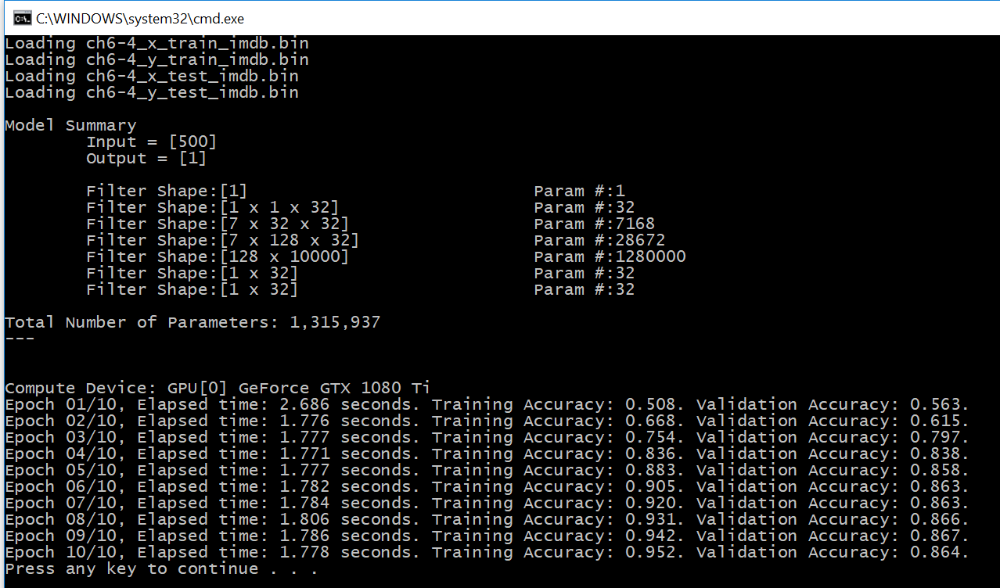

# Sequence Processing With Convnets

The original Python code can be found in [ch6-4.py](../../Python/ch6-4.py)

In Keras we have: 
```
model = Sequential()
model.add(layers.Embedding(max_features, 128, input_length=max_len))
model.add(layers.Conv1D(32, 7, activation='relu'))
model.add(layers.MaxPooling1D(5))
model.add(layers.Conv1D(32, 7, activation='relu'))
model.add(layers.GlobalMaxPooling1D())
model.add(layers.Dense(1))

model.summary()

model.compile(optimizer=RMSprop(lr=1e-4),
              loss='binary_crossentropy',
              metrics=['acc'])
history = model.fit(x_train, y_train,
                    epochs=10,
                    batch_size=128,
                    validation_split=0.2)
```

In C#, we'll need to write the helper method ``Util.Convolution1DWithReLU`` to create  a Conv1D layer. Then, we have: 
```
class Conv1TrainingEngine : TrainingEngine {
  protected override void createVariables() {
    x = CNTK.Variable.InputVariable(new int[] { 500 }, CNTK.DataType.Float, name: "x");
    y = CNTK.Variable.InputVariable(new int[] { 1 }, CNTK.DataType.Float, name: "y");
  }

  protected override void createModel() {
    model = CNTK.CNTKLib.OneHotOp(x, 10000, true, new CNTK.Axis(0));
    model = Util.Embedding(model, 128, computeDevice);
    model = CNTK.CNTKLib.TransposeAxes(model, new CNTK.Axis(1), new CNTK.Axis(0));
    model = Util.Convolution1DWithReLU(model, 32, 7, computeDevice);
    model = CNTK.CNTKLib.Pooling(model, CNTK.PoolingType.Max, new int[] { 5 }, new int[] { 5 });
    model = Util.Convolution1DWithReLU(model, 32, 7, computeDevice);
    model = CNTK.CNTKLib.Pooling(model, CNTK.PoolingType.Max, CNTK.NDShape.Unknown(), new int[] { 1 });
    model = Util.Dense(model, 1, computeDevice);
    model = CNTK.CNTKLib.Sigmoid(model);
  }
}
```

Finally, we get: 

