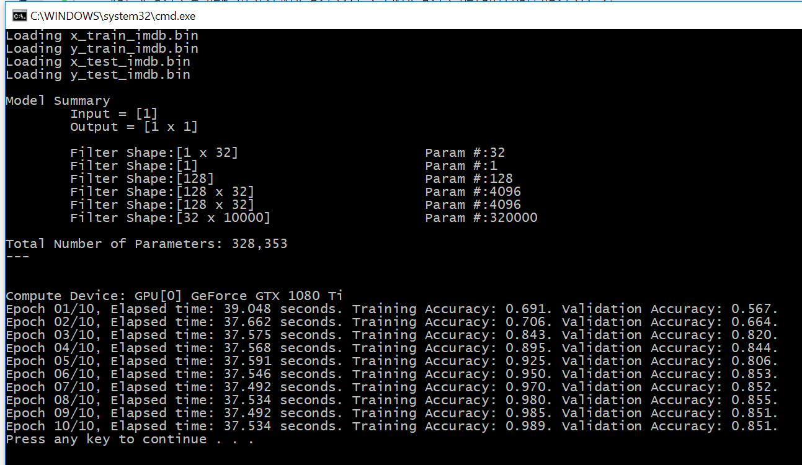


# Understanding Recurrent Neural Networks

The original Python code can be found in [ch6-2.py](../../Python/ch6-2.py)

In Keras, a simple LSTM model is defined as 
```
model = Sequential()
model.add(Embedding(max_features, 32))
model.add(LSTM(32))
model.add(Dense(1, activation='sigmoid
```

Unfortunately, CNTK does not provide an LSTM layer in C#, but we have a few ways to address this.  

1. Write our own LSTM layer in C#. A starting point is the LSTM implementation in the CNTK example 
[LSTMSequenceClassifier.cs](https://github.com/Microsoft/CNTK/blob/master/Examples/TrainingCSharp/Common/LSTMSequenceClassifier.cs)

2. Create the LSTM network in Python, load it in C#, and do the training in C#. 

Using the first approach, we have
```
uint numClasses = 10000;
int embedding_dim = 32;
int hidden_units = 32;
model = CNTK.CNTKLib.OneHotOp(x, numClass: numClasses, outputSparse: true, axis: new CNTK.Axis(0));
model = Util.Embedding(model, embedding_dim, computeDevice);
model = CNTK.CSTrainingExamples.LSTMSequenceClassifier.LSTM(model, hidden_units, hidden_units, computeDevice, "lstm");
model = Util.Dense(model, 1, computeDevice);
model = CNTK.CNTKLib.Sigmoid(model);
```

Using the second approach, in Python the LSTM model is created and saved with: 
```
x_placeholder = cntk.placeholder(shape=(), dynamic_axes=[cntk.Axis.default_batch_axis(), cntk.Axis.default_dynamic_axis()])
model = cntk.one_hot(x_placeholder, num_classes=Constants.max_words, sparse_output=True)
model = cntk.layers.Embedding(Constants.embedding_dim)(model)
model = cntk.layers.Recurrence(cntk.layers.LSTM(32))(model)
model = cntk.sequence.last(model)
model = cntk.layers.Dense(1, activation=cntk.sigmoid)(model)
model.save('ch6-2.cntk.model')
```

Note that `x_placeholder` is the input to the network, and its shape is empty--it's a scalar. 
This is because in the IMDB dataset, each paragraph is a 500x1 vector. 
But because we'll be using an LSTM, the "500" is absorbed into the "sequence" axis.

In C# we need to load the model, and replace the placeholder with the actual InputVariable x. 
It looks like this: 
```
var model_path = "ch6-2.cntk.model";
model = CNTK.Function.Load(model_path, computeDevice);
var replacements = new CNTK.UnorderedMapVariableVariable() { { model.Placeholders()[0], x } };
model.ReplacePlaceholders(replacements);
```

Both approaches can be found in the class `TrainingEngine_with_LSTMs` -- just change the flag `use_saved_model` 
```
class TrainingEngine_with_LSTMs : TrainingEngine {
  protected override void createVariables() {
    x = CNTK.Variable.InputVariable(new int[] { 1 }, CNTK.DataType.Float, name: "x");
    var y_axis = new List<CNTK.Axis>() { CNTK.Axis.DefaultBatchAxis() };
    y = CNTK.Variable.InputVariable(new int[] { 1 }, CNTK.DataType.Float, dynamicAxes: y_axis, name: "y");
  }

  protected override void createModel() {
    bool use_saved_model = true;
    if (use_saved_model) {
      var model_path = "ch6-2.cntk.model";
      model = CNTK.Function.Load(model_path, computeDevice);
      var replacements = new CNTK.UnorderedMapVariableVariable() { { model.Placeholders()[0], x } };
      model.ReplacePlaceholders(replacements);
    }
    else {
      uint numClasses = 10000;
      int embedding_dim = 32;
      int hidden_units = 32;
      model = CNTK.CNTKLib.OneHotOp(x, numClass: numClasses, outputSparse: true, axis: new CNTK.Axis(0));
      model = Util.Embedding(model, embedding_dim, computeDevice);
      model = CNTK.CSTrainingExamples.LSTMSequenceClassifier.LSTM(model, hidden_units, hidden_units, computeDevice, "lstm");
      model = Util.Dense(model, 1, computeDevice);
      model = CNTK.CNTKLib.Sigmoid(model);
    }
  }
}
```

To put it all together the training is done in: 
```
void run() {
  var x_train = Util.load_binary_file("x_train_imdb.bin", 25000, 500);
  var y_train = Util.load_binary_file("y_train_imdb.bin", 25000);
  var x_test = Util.load_binary_file("x_test_imdb.bin", 25000, 500);
  var y_test = Util.load_binary_file("y_test_imdb.bin", 25000);

  var engine = new TrainingEngine_with_LSTMs() { num_epochs = 10, batch_size = 128, sequence_length = 500 };
  engine.setData(x_train, y_train, x_test, y_test);
  engine.train();
}
```

Finally, we get:


