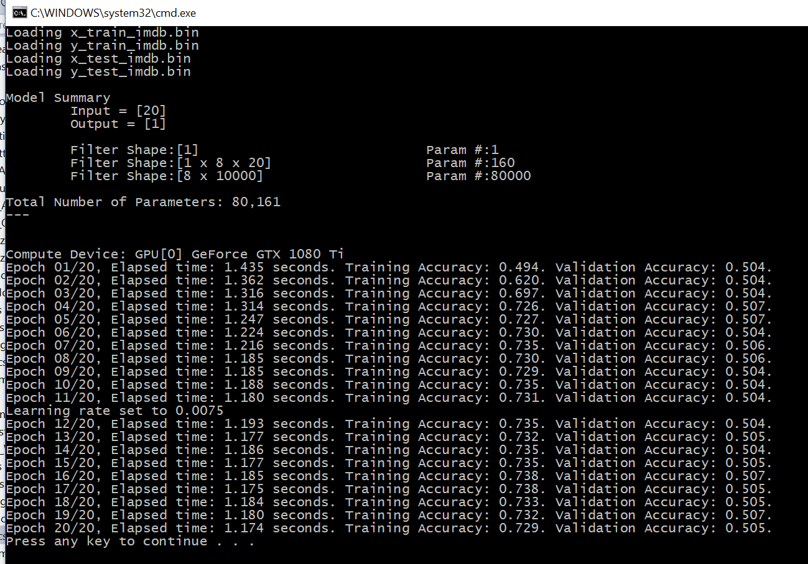
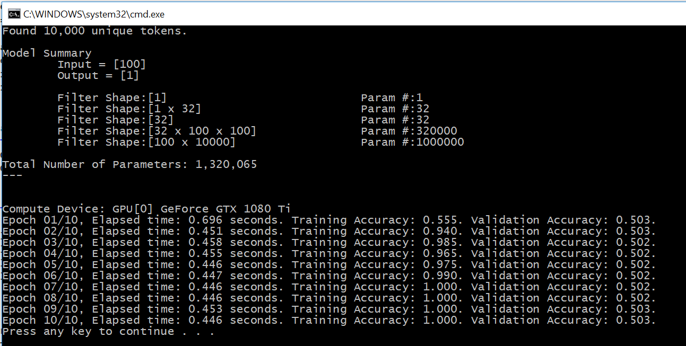

# Using Word Embeddings

The original Python code can be found in [ch6-1_b.py](../../Python/ch6-1_b.py)

With Keras, an embedding layer is simply created as: 

```
from keras.layers import Embedding

# The Embedding layer takes at least two arguments:
# the number of possible tokens, here 1000 (1 + maximum word index),
# and the dimensionality of the embeddings, here 64.
embedding_layer = Embedding(1000, 64)
```

Unfortunately, CNTK in C# does not have an Embedding layer, and we'll need to create it from scratch. 

As a guide, we can use the CNTK Python implementation in [layers.py](https://github.com/Microsoft/CNTK/blob/master/bindings/python/cntk/layers/layers.py). 
This is done in the following method

```
static public CNTK.Function Embedding(CNTK.Variable x, int shape, CNTK.DeviceDescriptor computeDevice, float[][] weights=null, string name = "") {
  CNTK.Function result;
  // based on the Embedding defined in https://github.com/Microsoft/CNTK/blob/master/bindings/python/cntk/layers/layers.py      
  if (weights == null) {
    var weight_shape = new int[] { shape, CNTK.NDShape.InferredDimension };
    var E = new CNTK.Parameter(
      weight_shape, 
      CNTK.DataType.Float, 
      CNTK.CNTKLib.GlorotUniformInitializer(), 
      computeDevice, name: "embedding_" + name);
    result = CNTK.CNTKLib.Times(E, x);
  }
  else {
    var weight_shape = new int[] { shape, x.Shape.Dimensions[0] };
    System.Diagnostics.Debug.Assert(shape == weights[0].Length);
    System.Diagnostics.Debug.Assert(weight_shape[1] == weights.Length);
    var w = convert_jagged_array_to_single_dimensional_array(weights);
    var ndArrayView = new CNTK.NDArrayView(weight_shape, w, computeDevice, readOnly: true);
    var E = new CNTK.Constant(ndArrayView, name: "fixed_embedding_"+name);
    result = CNTK.CNTKLib.Times(E, x);
  }
  return result;
}
```

## TrainingEngine, ReduceLROnPlateau

Before we see how an Embedding Layer is used, let's go quickly over the helper class `TrainingEngine` that we'll use for all examples from now on. 

When the data sets are small enough to fit in memory, the features are typically stored in a `float[][]` array, and the labels are stored in a `float[]` array (for simplicity). 

Then, in each epoch:
* during the training phase, we shuffle the training set, group it in mini-batches, and do back-propagation. 
* during the evaluation phase, we go over the validation set, and compute the metric of interest. 

This procedure is encapsulated inside the `TrainingEngine` class -- it's really nothing fancy, and just regroups what we did in previous chapters. 

The only addition that we have is the class `ReduceLROnPlateau` which is similar to what Keras has ("[reducelronplateau](https://keras.io/callbacks/#reducelronplateau)"), and
dynamically reduces the learning rate if the training loss is not improving. 

Given the `TrainingEngine`, for all examples from now on, we'll only need to define the CNTK input variables, and the CNTK model. Let's see how this is done. 


## Learning word embeddings with the Embedding Layer

We'll start with the IDMB movie review data set. In Keras, the train/test set is prepared as follows: 

```
from keras.datasets import imdb
from keras import preprocessing

# Number of words to consider as features
max_features = 10000
# Cut texts after this number of words 
# (among top max_features most common words)
maxlen = 20

# Load the data as lists of integers.
(x_train, y_train), (x_test, y_test) = imdb.load_data(num_words=max_features)

# This turns our lists of integers
# into a 2D integer tensor of shape `(samples, maxlen)`
x_train = preprocessing.sequence.pad_sequences(x_train, maxlen=maxlen)
x_test = preprocessing.sequence.pad_sequences(x_test, maxlen=maxlen)
```

To make life easier, we'll save them in corresponding `.bin` files, and load them in C# with
```
var x_train = Util.load_binary_file("x_train_imdb.bin", 25000, 20);
var y_train = Util.load_binary_file("y_train_imdb.bin", 25000);
```

In Keras a simple network that uses 8-dimensional embeddings for each word, followed by a Dense 
layer with a sigmoid activation is defined as: 

```
from keras.models import Sequential
from keras.layers import Flatten, Dense

model = Sequential()
# We specify the maximum input length to our Embedding layer
# so we can later flatten the embedded inputs
model.add(Embedding(10000, 8, input_length=maxlen))
# After the Embedding layer, 
# our activations have shape `(samples, maxlen, 8)`.

# We flatten the 3D tensor of embeddings 
# into a 2D tensor of shape `(samples, maxlen * 8)`
model.add(Flatten())

# We add the classifier on top
model.add(Dense(1, activation='sigmoid'))
```

In C#, the input variables and the network definition are in the class
```
class LearningWordEmbeddings: TrainingEngine {
  protected override void createVariables() {
    x = CNTK.Variable.InputVariable(new int[] { x_train[0].Length }, CNTK.DataType.Float);
    y = CNTK.Variable.InputVariable(new int[] { 1 }, CNTK.DataType.Float);
  }

  protected override void createModel() {
    uint numClasses = 10000;
    model = CNTK.CNTKLib.OneHotOp(x, numClass: numClasses, outputSparse: true, axis: new CNTK.Axis(0));
    model = Util.Embedding(model, 8, computeDevice);
    model = Util.Dense(model, 1, computeDevice);
    model = CNTK.CNTKLib.Sigmoid(model);
  }
}
```

And to put everything together: 
```
void learning_word_embeddings_with_the_embedding_layer() {
  var x_train = Util.load_binary_file("x_train_imdb.bin", 25000, 20);
  var y_train = Util.load_binary_file("y_train_imdb.bin", 25000);
  var x_test = Util.load_binary_file("x_test_imdb.bin", 25000, 20);
  var y_test = Util.load_binary_file("y_test_imdb.bin", 25000);
      
  var engine = new LearningWordEmbeddings() { num_epochs = 20, batch_size = 32, lr=0.01 };
  engine.setData(x_train, y_train, x_test, y_test);
  engine.train();
}
```

When we run it we get the following: 




## Using pre-trained word embeddings

Grab a cup of coffee. This will be a long one. :-)


### Step 1: Download the Glove embeddings and create the embeddings matrix

We'll need to download the [Glove](https://nlp.stanford.edu/projects/glove/) 
word embeddings from [http://nlp.stanford.edu/data/glove.6B.zip](http://nlp.stanford.edu/data/glove.6B.zip), 
and extract it to a local directory. 

The Python code for reading the embeddings is: 

```
def preprocess_embeddings():
    import numpy as np
    import tqdm

    glove_dir = 'C:\\Users\\anastasios\\Downloads\\glove.6B'

    embeddings_index = {}
    glove_path = os.path.join(glove_dir, 'glove.6B.100d.txt')
    f = open(glove_path, encoding='utf8')
    print('Processing ', glove_path)
    for line in f:
        values = line.split()
        word = values[0]
        coefs = np.asarray(values[1:], dtype='float32')
        embeddings_index[word] = coefs
    f.close()

    print('Found %s word vectors.' % len(embeddings_index))
    return embeddings_index
```

In C#, we have: 
```
Dictionary<string, float[]> preprocess_embeddings() {
  var glove_dir = "C:\\Users\\anastasios\\Downloads\\glove.6B";
  var embeddings_index = new Dictionary<string, float[]>();
  var glove_path = System.IO.Path.Combine(glove_dir, "glove.6B.100d.txt");
  Console.WriteLine($"Processing {glove_path}");
  foreach(var line in System.IO.File.ReadLines(glove_path, Encoding.UTF8)) {
    var values = line.Split(' ');
    var word = values[0];
    var coefs = values.Skip(1).Select(v => Single.Parse(v)).ToArray();
    System.Diagnostics.Debug.Assert(coefs.Length == Constants.embedding_dim);
    embeddings_index[word] = coefs;        
  }
  Console.WriteLine($"Found {embeddings_index.Keys.Count:n0} word vectors.");
  return embeddings_index;
}
```

Of course, you'll need to replace my local directory in `glove_dir` with what you have :-)

Then, we need to create the embedding matrix. In Python we have: 
```
def compute_embedding_matrix(tokenizer):
    embeddings_index = preprocess_embeddings()
    embedding_matrix = np.zeros((Constants.max_words, Constants.embedding_dim))
    for word, i in tokenizer.word_index.items():
        embedding_vector = embeddings_index.get(word)
        if i < Constants.max_words:
            if embedding_vector is not None:
                # Words not found in embedding index will be all-zeros.
                embedding_matrix[i] = embedding_vector
    return embedding_matrix
```

In C#, we have
```
float[][] compute_embedding_matrix(FromKeras.Tokenizer tokenizer) {
  var embedding_matrix = new float[Constants.max_words][];
  var embeddings_index = preprocess_embeddings();
  foreach (var entry in tokenizer.word_index) {
    var word = entry.Key;
    var i = entry.Value;
    if (i>=Constants.max_words) { continue; }
    float[] embedding_vector;
    embeddings_index.TryGetValue(word, out embedding_vector);
    if (embedding_vector == null) {
      // Words not found in embedding index will be all-zeros.
      embedding_vector = new float[Constants.embedding_dim];
    }
    else {
      System.Diagnostics.Debug.Assert(embedding_vector.Length == Constants.embedding_dim);
    }
    embedding_matrix[i] = embedding_vector;
  }
  for (int i=0; i<embedding_matrix.Length; i++) {
    if ( embedding_matrix[i]!=null ) { continue; }
    embedding_matrix[i] = new float[Constants.embedding_dim];
  }
  return embedding_matrix;
}
```

### Step 2: Download the IMDB data as raw text, and tokenize it

We'll need to download [http://ai.stanford.edu/~amaas/data/sentiment/aclImdb_v1.tar.gz](http://ai.stanford.edu/~amaas/data/sentiment/aclImdb_v1.tar.gz) 
and extract it to a local directory. 

Once this is done, first we `load_text_labels()`, then we use a `Tokenizer` in `tokenize_alImdb()`, and finally we create the training/validation set
in `from_raw_text_to_word_embeddings()` -- see the C# code for more details. 

### Step 3: Model Definition

In Keras, the model is defined as follows 
```
from keras.models import Sequential
from keras.layers import Embedding, Flatten, Dense

model = Sequential()
model.add(Embedding(max_words, embedding_dim, input_length=maxlen))
model.add(Flatten())
model.add(Dense(32, activation='relu'))
model.add(Dense(1, activation='sigmoid'))
```
and the GloVe embeddings are loaded using
```
model.layers[0].set_weights([embedding_matrix])
model.layers[0].trainable = False
```

In C#, we have
```
class GloVeTrainingEngine : TrainingEngine {
  public float[][] embedding_weights = null;
  protected override void createVariables() {
    x = CNTK.Variable.InputVariable(new int[] { x_train[0].Length }, CNTK.DataType.Float);
    y = CNTK.Variable.InputVariable(new int[] { 1 }, CNTK.DataType.Float);
  }

  protected override void createModel() {       
    model = CNTK.CNTKLib.OneHotOp(x, numClass: (uint)Constants.max_words, outputSparse: true, axis: new CNTK.Axis(0));
    model = Util.Embedding(model, Constants.embedding_dim, computeDevice, weights: embedding_weights);
    model = Util.Dense(model, 32, computeDevice);
    model = CNTK.CNTKLib.ReLU(model);
    model = Util.Dense(model, 1, computeDevice);
    model = CNTK.CNTKLib.Sigmoid(model);
  }
}
```
and we put it together in 
```
void use_glove_word_embeddings(bool preload_weights=true) {
  float[][] x_train, x_val;
  float[] y_train, y_val;
  Tokenizer tokenizer;
  from_raw_text_to_word_embeddings(out tokenizer, out x_train, out y_train, out x_val, out y_val);
      
  var engine = new GloVeTrainingEngine() { num_epochs = 10, batch_size = 32, lr=0.001 };
  engine.embedding_weights = preload_weights ? compute_embedding_matrix(tokenizer) : null;

  engine.setData(x_train, y_train, x_val, y_val);
  engine.train();
}
```

This is what we get when we run it: 


We overfit like crazy. 

Finally, let's see when we run it with no preloading of weights
```
    static void Main(string[] args) {
      //new Program().learning_word_embeddings_with_the_embedding_layer();
      new Program().use_glove_word_embeddings(preload_weights: false);
    }
```

We get: 



Observe that the number of parameters in the network is now much larger, because we allow the embedding layer to be trainable. 

