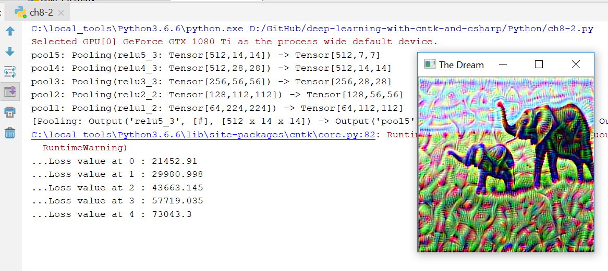
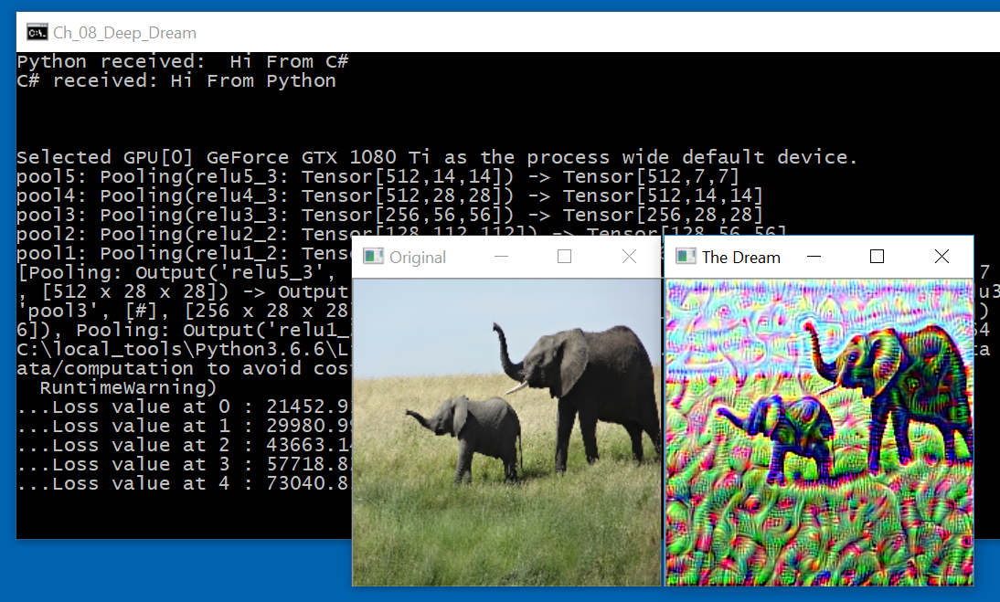

# Deep Dream

The original Python code can be found in [ch8-2.py](../../Python/ch8-2.py)

Unfortunately, we cannot do the Keras port entirely in C# with CNTK. 

The reason is that at some point we need to compute gradients, and this is 
something that is not supported by the C# API (see also https://github.com/Microsoft/CNTK/issues/2661). 

In previous examples (see for example [Ch_05_Visualizing_Convnet_Filters](../Ch_05_Visualizing_Convnet_Filters)),
we used the P/Invoke method to get around this problem:  we wrote the main algorithm in C++ with the C++ CNTK API, 
built it as a dynamically linked library (.dll), and then passed the results back to C#. 

Herein we'll follow a different approach. 

* First, we'll convert the Keras Python code to CNTK Python code. 

* Second, we'll see how we can seamlessly call Python code from C# using [Python for NET](https://github.com/pythonnet/pythonnet).

## Deep Dream with Python CNTK

The original Keras implementation of the book used Inception V3 as the base neural network. 
The code is in the function `run()` of [ch8-2.py](../../Python/ch8-2.py). 

Because we used VGG16 in all previous examples, let's modify the Keras code so that it uses VGG16 as the base neural network. 
This is done in the function `run_vgg16()`. 

The ported CNTK python code can be found in the function `run_cntk(image_path, model_path)`. 

```
def gradient_ascent_cntk(loss, x, iterations, step):
    for i in range(iterations):
        grad_values, loss_value = loss.grad({loss.arguments[0]: x}, outputs=(loss.output,))
        grad_values = grad_values[0]
        m = np.mean(np.abs(grad_values))
        loss_value = loss_value[0]/m
        grad_values /= m
        print('...Loss value at', i, ':', loss_value)
        x += step * grad_values
    return x


def run_cntk(image_path, model_path):
    import functools
    import cv2

    model = cntk.load_model(model_path)

    pool_nodes = list()
    for l in cntk.logging.depth_first_search(model, lambda x: True, depth=0):
        if type(l) is cntk.ops.functions.Function:
            description = str(l)
            if description.find('Pooling') >= 0:
                pool_nodes.append(l)
                print(l)
    print(pool_nodes)

    # node contributions to the loss metric
    layer_contributions = {
        pool_nodes[2]: 1,
        pool_nodes[3]: 3,
    }

    # Define the loss
    loss = None
    for layer in layer_contributions.keys():
        coeff = layer_contributions[layer]
        activation = layer.output
        scaling = functools.reduce(lambda x, y: x*y, activation.shape)
        sum_squares = cntk.reduce_sum(cntk.square(activation))
        scaled_sum_squares = (coeff/scaling) * sum_squares
        if loss is None:
            loss = scaled_sum_squares
        else:
            loss += scaled_sum_squares

    dream = cntk.input_variable(shape=model.arguments[0].shape, needs_gradient=True, name='features')
    model = cntk.ops.combine(loss).clone(cntk.ops.CloneMethod.freeze, substitutions={model.arguments[0]: dream})
    step = 0.1  # Gradient ascent step size
    iterations = 5  # Number of ascent steps per scale

    # Load the image into a Numpy array
    img = cv2.imread(image_path)
    img = cv2.resize(img, (224, 224))

    # cv2.imshow('Original Image', img.copy())

    img = img.astype(np.float32)
    img = np.transpose(img, (2, 0, 1))
    img /= 127.5
    img -= 1
    img = gradient_ascent_cntk(model, img, iterations=iterations, step=step)
    img = np.transpose(img, (1, 2, 0))
    img /= 2.
    img += 0.5
    img *= 255.
    img = np.clip(img, 0, 255).astype('uint8')
    return img
```

To run this code, we use the function `demo_cntk()`. 

```
def demo_cntk():
    import cntk_util
    cntk_util.VGG16.get_model(features_node=None, include_top=True)
    image_path = os.path.join('..', 'DeepLearning', 'Ch_05_Class_Activation_Heatmaps', 'creative_commons_elephant.jpg')

    import cv2
    dream_image = run_cntk(image_path=image_path, model_path=cntk_util.VGG16.vgg16_filename)
    cv2.imshow('The Dream', dream_image)
    cv2.waitKey(0)


if __name__ == '__main__':
    # run_vgg16()
    demo_cntk()
    print('Elapsed time: {0}'.format(datetime.timedelta(seconds=time.time() - start_time)))
```

This is what we get when we run it. 




## Calling Python From C#

This part is a little bit tricky, but if you get it to work, then it is very cool. 

We will use [Python for NET](https://github.com/pythonnet/pythonnet), but we need a working Python Windows 10 installation first. 

If you are reading this, then you already have a few of them :-), 
but to keep it consistent, let's suppose that you start from scratch. Then, you can follow the instructions in the
[wiki](https://github.com/anastasios-stamoulis/deep-learning-with-csharp-and-cntk/wiki/Setting-up-Python-on-Windows-10-for-Machine-Learning)
to create a Python installation in `C:\local_tools\Python3.6.6`. Otherwise, just make sure that you have installed pythonnet with `pip install pythonnet`,
and you are using 64-bit Python. 

Let's look at the C# code now. First, we need to properly initialize some constants. You'll need to make the appropriate changes for your local setup. 

```
const string PYTHON_HOME_ = "C:\\local_tools\\Python3.6.6";
const string PYTHONNET_DLL_ = "C:\\local_tools\\Python3.6.6\\Lib\\site-packages\\Python.Runtime.dll";
const string KERAS_PORTED_CODE_ = "D:\\GitHub\\deep-learning-with-cntk-and-csharp\\Python";
```


We start and initialize the Python Engine as follows
```
// load the Python.NET dll, and start the (embedded) Python engine
var dll = System.Reflection.Assembly.LoadFile(PYTHONNET_DLL_);
var PythonEngine = dll.GetType("Python.Runtime.PythonEngine");

// to be on the safe side, update the PythonPath of the local engine
var PythonPathProperty = PythonEngine.GetProperty("PythonPath");
var pythonPath = (string)PythonPathProperty.GetValue(null);
pythonPath += ";" + KERAS_PORTED_CODE_;
pythonPath += ";" + PYTHON_HOME_ + "\\Lib\\site-packages";
PythonPathProperty.SetValue(null, pythonPath);
```

Then, we "import" the python script, and execute a method in it: 
```
// let's start executing some python code
dynamic Py = dll.GetType("Python.Runtime.Py");
dynamic GIL = Py.GetMethod("GIL").Invoke(null, null);

// import "ch8-2.py"
dynamic ch8_2 = Py.GetMethod("Import").Invoke(null, new object[] { "ch8-2" });

// response = ch8_2.get_response("Hi From C#")
var response = ch8_2.get_response("Hi From C#");
Console.WriteLine("C# received: "+response);
Console.WriteLine("\n\n");
```

We move on to call the `run_cntk` Python function which returns a numpy array that we'll convert to a `byte[]` array, which we feed into an Opencv MAT object
```
// let's call the run_cntk function from the Python script
var img = ch8_2.run_cntk(image_path, vgg16_model_path);

// convert the python numpy array to byte[]
byte[] img_data = convert_uint8_numpy_array_to_byte_array(img);

// display the image with OpenCV
var mat = new OpenCvSharp.Mat(224, 224, OpenCvSharp.MatType.CV_8UC3, img_data, 3 * 224);
OpenCvSharp.Cv2.ImShow("The Dream", mat);

// Show also the original image
OpenCvSharp.Cv2.ImShow("Original", OpenCvSharp.Cv2.ImRead(image_path).Resize(new OpenCvSharp.Size(224, 224)));
```

Eventually, we get: 



What we had in PyCharm, now we have it in a C# console app.

What kind of sorcery is this? 
