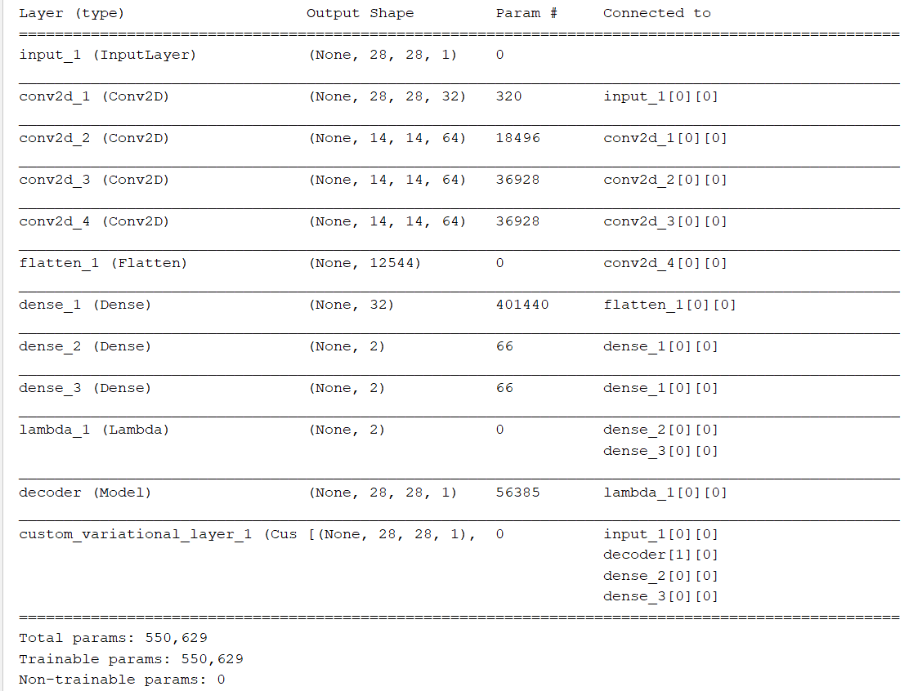
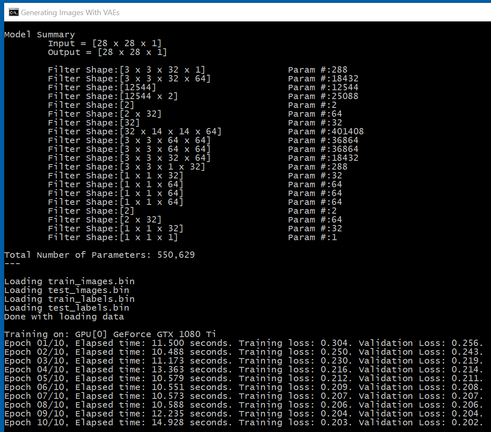
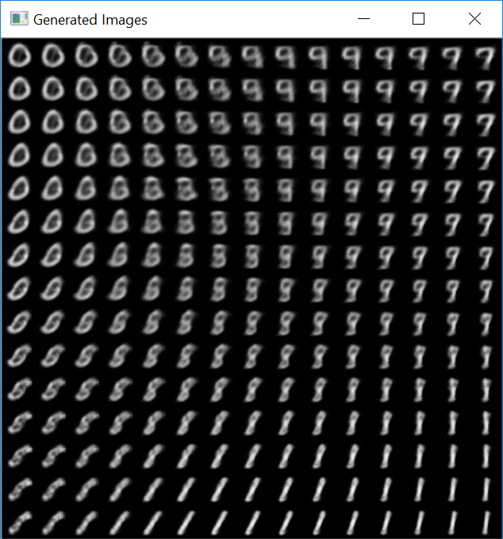

# Generating Images with Variational Autoencoders

The original Python code can be found in [ch8-4.py](../../Python/ch8-4.py)

As explained in the [write-up](https://github.com/fchollet/deep-learning-with-python-notebooks/blob/master/8.4-generating-images-with-vaes.ipynb), 

* "_A classical image autoencoder takes an image, 
maps it to a latent vector space via an "encoder" 
module, then decodes it back to an output with the same dimensions 
as the original image, via a "decoder" module. It is then trained by using as target data the same images as the input images, meaning that the autoencoder learns to reconstruct the original inputs._"

* "_A Variational Autoencoder (VAE), instead of 
compressing its input image into a fixed "code" 
In the latent space, turns the image 
into the parameters of a statistical distribution: a mean and 
a variance._"

* "_The VAE then uses the mean and variance parameters to randomly sample one element of the distribution, and decodes that element back to the original input._"

In Keras, the overall model is defined as
```
input_img = keras.Input(shape=img_shape)

# encoder
x = keras.layers.Conv2D(32, 3, padding='same', activation='relu')(input_img)
x = keras.layers.Conv2D(64, 3, padding='same', activation='relu', strides=(2, 2))(x)
x = keras.layers.Conv2D(64, 3, padding='same', activation='relu')(x)
x = keras.layers.Conv2D(64, 3, padding='same', activation='relu')(x)
shape_before_flattening = keras.backend.int_shape(x)
x = keras.layers.Flatten()(x)
x = keras.layers.Dense(32, activation='relu')(x)

# latent variables
z_mean = keras.layers.Dense(latent_dim)(x)
z_log_var = keras.layers.Dense(latent_dim)(x)
z = keras.layers.Lambda(sampling)([z_mean, z_log_var])

# decoder
decoder_input = keras.layers.Input(keras.backend.int_shape(z)[1:])
x = keras.layers.Dense(np.prod(shape_before_flattening[1:]), activation='relu')(decoder_input)
x = keras.layers.Reshape(shape_before_flattening[1:])(x)
x = keras.layers.Conv2DTranspose(32, 3, padding='same', activation='relu', strides=(2, 2))(x)
x = keras.layers.Conv2D(1, 3, padding='same', activation='sigmoid')(x)
decoder = keras.models.Model(decoder_input, x, name='decoder')
decoder.summary()

# overall model
z_decoded = decoder(z)
y = CustomVariationalLayer()([input_img, z_decoded, z_mean, z_log_var])
vae = keras.models.Model(input_img, y, name='vae_model')
vae.compile(optimizer='rmsprop', loss=None)
vae.summary()
```

and the `CustomVariationalLayer` defines the overall loss function
```
def vae_loss(x, z_decoded, z_mean, z_log_var):
    x = keras.backend.flatten(x)
    z_decoded = keras.backend.flatten(z_decoded)
    crossentropy_loss = keras.metrics.binary_crossentropy(x, z_decoded)
    square_ = keras.backend.square(z_mean)
    exp_ = keras.backend.exp(z_log_var)
    diff_ = 1 + z_log_var - square_ - exp_
    kl_loss = -5e-4 * keras.backend.mean(diff_, axis=-1)
    return keras.backend.mean(crossentropy_loss + kl_loss)
```

Porting the above to C# is, by now, straightforward. 
```
input_img = CNTK.Variable.InputVariable(new int[] { img_shape[0], img_shape[1], 1 }, CNTK.DataType.Float);

// encoder part
var x = Util.Convolution2DWithReLU(input_img, 32, new int[] { 3, 3 }, computeDevice, true, outputName: "dense_0");
x = Util.Convolution2DWithReLU(x, 64, new int[] { 3, 3 }, computeDevice, true, strides: new int[] { 2, 2 }, outputName: "dense_1");
x = Util.Convolution2DWithReLU(x, 64, new int[] { 3, 3 }, computeDevice, true, outputName: "dense_2");
x = Util.Convolution2DWithReLU(x, 64, new int[] { 3, 3 }, computeDevice, true, outputName: "dense_3");
var shape_before_dense = x.Output.Shape;
x = CNTK.CNTKLib.ReLU(Util.Dense(x, 32, computeDevice));
     
// latent variables
var z_mean = Util.Dense(x, latent_dim, computeDevice);
var z_log_var = Util.Dense(x, latent_dim, computeDevice);
var epsilon = CNTK.CNTKLib.NormalRandom(new int[] { latent_dim }, CNTK.DataType.Float);
var z = CNTK.CNTKLib.Plus(z_mean, CNTK.CNTKLib.ElementTimes(CNTK.CNTKLib.Exp(z_log_var), epsilon), "input_z");

// decoder
x = CNTK.CNTKLib.ReLU(Util.Dense(z, shape_before_dense.TotalSize, computeDevice), name: "decoder");
x = CNTK.CNTKLib.Reshape(x, shape_before_dense);
x = Util.ConvolutionTranspose(x, 
  computeDevice, 
  filter_shape: new int[] { 3, 3 }, 
  num_filters: 32, 
  use_padding: true,
  activation: CNTK.CNTKLib.ReLU,
  strides: new int[] { 2, 2 },
  output_shape: new int[] {28, 28});
model = Util.Convolution2D(x, 1, new int[] { 3, 3, }, computeDevice, use_padding: true, activation: CNTK.CNTKLib.Sigmoid);

// regularization metric
var square_ = CNTK.CNTKLib.Square(z_mean);
var exp_ = CNTK.CNTKLib.Exp(z_log_var);
var constant_1 = CNTK.Constant.Scalar(CNTK.DataType.Float, 1.0);
var diff_ = CNTK.CNTKLib.Plus(constant_1, z_log_var);
diff_ = CNTK.CNTKLib.Minus(diff_, square_);
diff_ = CNTK.CNTKLib.Minus(diff_, exp_);
var constant_2 = CNTK.Constant.Scalar(CNTK.DataType.Float, -5e-4);
var regularization_metric = CNTK.CNTKLib.ElementTimes(constant_2, CNTK.CNTKLib.ReduceMean(diff_, CNTK.Axis.AllStaticAxes()));

// overall loss function
var crossentropy_loss = CNTK.CNTKLib.BinaryCrossEntropy(model, input_img);
crossentropy_loss = CNTK.CNTKLib.ReduceMean(crossentropy_loss, CNTK.Axis.AllStaticAxes());
loss = CNTK.CNTKLib.Plus(crossentropy_loss, regularization_metric);
```

This is the model summary under Keras



and here's what we get with C# and CNTK. 



As a sanity check, in both cases the total number of parameters for training is the same. 

To train the network, we use the MNIST dataset that we used in
[Ch_02_First_Look_At_A_Neural_Network](../Ch_02_First_Look_At_A_Neural_Network). 

It's interesting that when the network is trained, there's no need to feed any "labels". 

In Keras, this is done in
```
vae.fit(x=x_train, y=None,
        shuffle=True,
        epochs=20,
        batch_size=batch_size,
        validation_data=(x_test, None))
```
and with CNTK we have: 
```
var x_minibatch = Util.get_tensors(input_img.Shape, x_train, train_indices, pos, pos_end, computeDevice);
var feed_dictionary = new Dictionary<CNTK.Variable, CNTK.Value> { { input_img, x_minibatch } };
trainer.TrainMinibatch(feed_dictionary, false, computeDevice);
```

Finally, here are some sample auto-generated images:

