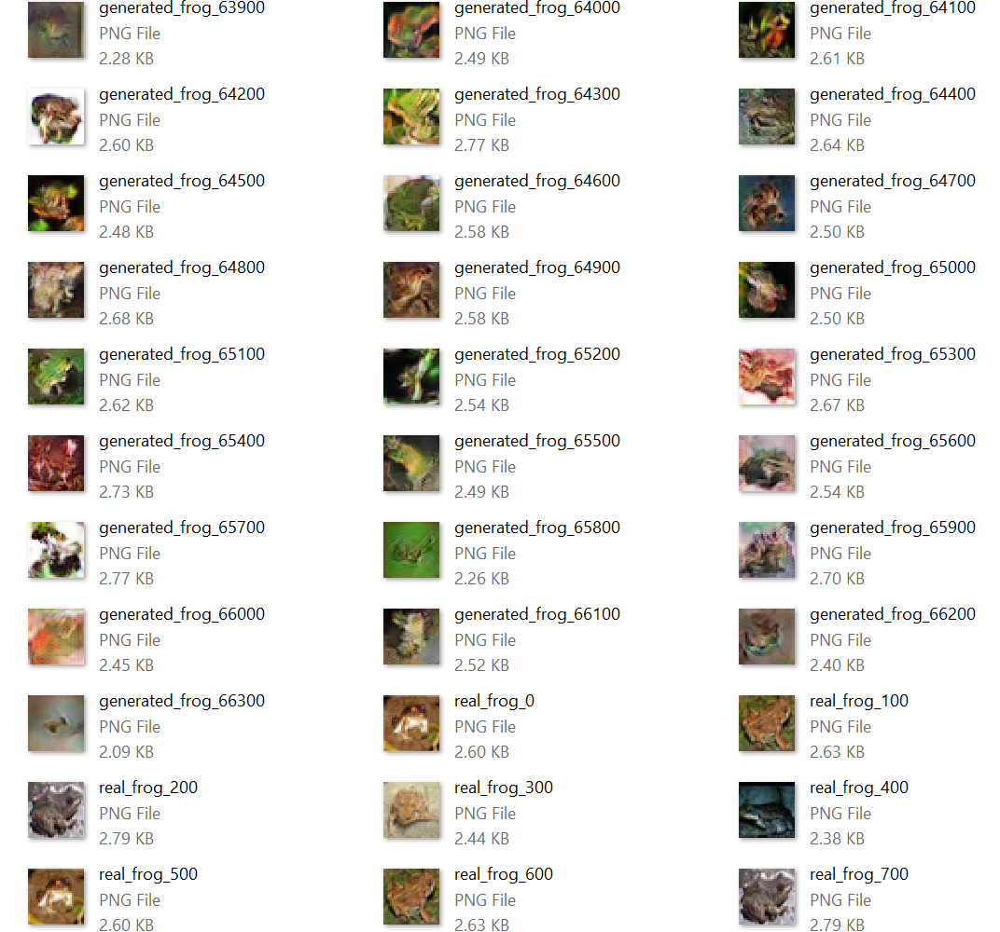

# Introduction To Generative Adversarial Networks

The original Python code can be found in [ch8-5.py](../../Python/ch8-5.py)

The details can be found in the [write-up](https://github.com/fchollet/deep-learning-with-python-notebooks/blob/master/8.5-introduction-to-gans.ipynb), 
but very quickly let's see what the setup is. 

* We start from 32x32 frog images of the CIFAR10 dataset.

* A generator network creates fake 32x32 frog images, starting from random (latent) variables. 

* A discriminator network takes as input 32x32 images and labels them as "true" frogs, or "fake" frogs. 

* A GAN network chains the generator and discriminator together, and trains the generator so that it fools the discriminator. 

## Input Data

In Python we have: 
```
def load_data():
    # Load CIFAR10 data
    (x_train, y_train), (_, _) = keras.datasets.cifar10.load_data()

    # Select frog images (class 6)
    x_train = x_train[y_train.flatten() == 6]

    # Normalize data
    x_train = x_train.reshape((x_train.shape[0],) + (height, width, channels)).astype('float32') / 255.
    x_channels_first = np.transpose(x_train, (0, 3, 1, 2))
    x_channels_first = np.ascontiguousarray(x_channels_first, dtype=np.float32)
    x_channels_first.tofile('x_channels_first_8_5.bin')
    print('Saved x_channels_first_8_5.bin')
    return x_train
```

In C#, we just load the saved images in a `float[][]` array
```
void load_data() {
  var num_images = 5000;
  var data_filename = "x_channels_first_8_5.bin";
  var num_bytes_per_image = sizeof(float) * channels * width * height;
  System.Diagnostics.Debug.Assert(System.IO.File.Exists(data_filename));
  System.Diagnostics.Debug.Assert(new System.IO.FileInfo(data_filename).Length == num_images * num_bytes_per_image);
  x_train = Util.load_binary_file(data_filename, num_images, channels * width * height);
}
```

## Model Definition

In Keras, the generator network is defined as:
```
def create_generator():
    generator_input = keras.Input(shape=(latent_dim,))

    # First, transform the input into a 16x16 128-channels feature map
    x = keras.layers.Dense(128 * 16 * 16)(generator_input)
    x = keras.layers.LeakyReLU()(x)
    x = keras.layers.Reshape((16, 16, 128))(x)

    # Then, add a convolution layer
    x = keras.layers.Conv2D(256, 5, padding='same')(x)
    x = keras.layers.LeakyReLU()(x)

    # Upsample to 32x32
    x = keras.layers.Conv2DTranspose(256, 4, strides=2, padding='same')(x)
    x = keras.layers.LeakyReLU()(x)

    # Few more conv layers
    x = keras.layers.Conv2D(256, 5, padding='same')(x)
    x = keras.layers.LeakyReLU()(x)
    x = keras.layers.Conv2D(256, 5, padding='same')(x)
    x = keras.layers.LeakyReLU()(x)

    # Produce a 32x32 1-channel feature map
    x = keras.layers.Conv2D(channels, 7, activation='tanh', padding='same')(x)
    generator = keras.models.Model(generator_input, x)
    generator.summary()
    return generator
```

In C#, the corresponding method is: 
```
CNTK.Function create_generator() {
  var input_variable = CNTK.Variable.InputVariable(new int[] { latent_dim }, CNTK.DataType.Float, name: "generator_input");
  var x = Util.Dense(input_variable, 128 * 16 * 16, computeDevice);
  x = CNTK.CNTKLib.LeakyReLU(x);
  x = CNTK.CNTKLib.Reshape(x, new int[] { 16, 16, 128 });
  x = Util.Convolution2D(x, 256, new int[] { 5, 5 }, computeDevice, use_padding: true, activation: CNTK.CNTKLib.LeakyReLU);
  x = Util.ConvolutionTranspose(x, computeDevice,
    filter_shape: new int[] { 4, 4 },
    num_filters: 256,
    strides: new int[] { 2, 2 },
    output_shape: new int[] { 32, 32 },
    use_padding: true,
    activation: CNTK.CNTKLib.LeakyReLU);
  x = Util.Convolution2D(x, 256, new int[] { 5, 5 }, computeDevice, use_padding: true, activation: CNTK.CNTKLib.LeakyReLU);
  x = Util.Convolution2D(x, 256, new int[] { 5, 5 }, computeDevice, use_padding: true, activation: CNTK.CNTKLib.LeakyReLU);
  x = Util.Convolution2D(x, channels, new int[] { 7, 7 }, computeDevice, use_padding: true, activation: CNTK.CNTKLib.Tanh);
  return x;      
}
```

For the discriminator, in Python we have: 
```
def create_discriminator():
    discriminator_input = keras.layers.Input(shape=(height, width, channels))
    x = keras.layers.Conv2D(128, 3)(discriminator_input)
    x = keras.layers.LeakyReLU()(x)
    x = keras.layers.Conv2D(128, 4, strides=2)(x)
    x = keras.layers.LeakyReLU()(x)
    x = keras.layers.Conv2D(128, 4, strides=2)(x)
    x = keras.layers.LeakyReLU()(x)
    x = keras.layers.Conv2D(128, 4, strides=2)(x)
    x = keras.layers.LeakyReLU()(x)
    x = keras.layers.Flatten()(x)

    # One dropout layer - important trick!
    x = keras.layers.Dropout(0.4)(x)

    # Classification layer
    x = keras.layers.Dense(1, activation='sigmoid')(x)

    discriminator = keras.models.Model(discriminator_input, x)
    discriminator.summary()

    # To stabilize training, we use learning rate decay
    # and gradient clipping (by value) in the optimizer.
    discriminator_optimizer = keras.optimizers.RMSprop(lr=0.0008, clipvalue=1.0, decay=1e-8)
    discriminator.compile(optimizer=discriminator_optimizer, loss='binary_crossentropy')

    # Set discriminator weights to non-trainable
    # (will only apply to the `gan` model)
    discriminator.trainable = False
    return discriminator
```
whereas in C# we have: 
```
CNTK.Function create_discriminator() {
  var input_variable = CNTK.Variable.InputVariable(new int[] { width, height, channels }, CNTK.DataType.Float, name: "discriminator_input");
  var x = Util.Convolution2D(input_variable, 128, new int[] { 3, 3 }, computeDevice, activation: CNTK.CNTKLib.LeakyReLU);
  x = Util.Convolution2D(x, 128, new int[] { 4, 4 }, computeDevice, strides: new int[] { 2, 2 }, activation: CNTK.CNTKLib.LeakyReLU);
  x = Util.Convolution2D(x, 128, new int[] { 4, 4 }, computeDevice, strides: new int[] { 2, 2 }, activation: CNTK.CNTKLib.LeakyReLU);
  x = Util.Convolution2D(x, 128, new int[] { 4, 4 }, computeDevice, strides: new int[] { 2, 2 }, activation: CNTK.CNTKLib.LeakyReLU);
  x = CNTK.CNTKLib.Dropout(x, 0.4);
  x = Util.Dense(x, 1, computeDevice);
  x = CNTK.CNTKLib.Sigmoid(x);
  return x;
}
```

Finally, the GAN network is defined in Keras as: 
```
def create_gan():
    generator = create_generator()
    discriminator = create_discriminator()

    gan_input = keras.Input(shape=(latent_dim,))
    gan_output = discriminator(generator(gan_input))
    gan = keras.models.Model(gan_input, gan_output)

    gan_optimizer = keras.optimizers.RMSprop(lr=0.0004, clipvalue=1.0, decay=1e-8)
    gan.compile(optimizer=gan_optimizer, loss='binary_crossentropy')
    return generator, discriminator, gan
```
whereas in C# we have: 
```
void create_gan() {
  label_var = CNTK.Variable.InputVariable(shape: new CNTK.NDShape(0), dataType: CNTK.DataType.Float, name: "label_var");
  generator = create_generator();
  discriminator = create_discriminator();
  gan = discriminator.Clone(CNTK.ParameterCloningMethod.Share, 
    replacements: new Dictionary<CNTK.Variable, CNTK.Variable>() { { discriminator.Arguments[0], generator } });

  discriminator_loss = CNTK.CNTKLib.BinaryCrossEntropy(discriminator, label_var);
  discriminator_learner = CNTK.CNTKLib.AdaDeltaLearner(
    parameters: new CNTK.ParameterVector((System.Collections.ICollection)discriminator.Parameters()),
    learningRateSchedule: new CNTK.TrainingParameterScheduleDouble(1));        
  discriminator_trainer = CNTK.CNTKLib.CreateTrainer(discriminator, discriminator_loss, discriminator_loss, new CNTK.LearnerVector() { discriminator_learner });

  gan_loss = CNTK.CNTKLib.BinaryCrossEntropy(gan, label_var);
  gan_learner = CNTK.CNTKLib.AdaDeltaLearner(
    parameters: new CNTK.ParameterVector((System.Collections.ICollection)generator.Parameters()),
    learningRateSchedule: new CNTK.TrainingParameterScheduleDouble(1));
  gan_trainer = CNTK.CNTKLib.CreateTrainer(gan, gan_loss, gan_loss, new CNTK.LearnerVector() { gan_learner });
}
```

In both cases, the GAN network is comprised by a trainable generator, and a "frozen" discriminator. 

## Training

With Keras, in each iteration we have: 
```
# Sample random points in the latent space
random_latent_vectors = np.random.normal(size=(batch_size, latent_dim))

# Decode them to fake images
generated_images = generator.predict(random_latent_vectors)

# Combine them with real images
stop = start + batch_size
real_images = x_train[start: stop]
combined_images = np.concatenate([generated_images, real_images])

# Assemble labels discriminating real from fake images
labels = np.concatenate([np.ones((batch_size, 1)), np.zeros((batch_size, 1))])
# Add random noise to the labels - important trick!
labels += 0.05 * np.random.random(labels.shape)

# Train the discriminator
d_loss = discriminator.train_on_batch(combined_images, labels)

# sample random points in the latent space
random_latent_vectors = np.random.normal(size=(batch_size, latent_dim))

# Assemble labels that say "all real images"
misleading_targets = np.zeros((batch_size, 1))

# Train the generator (via the gan model,
# where the discriminator weights are frozen)
a_loss = gan.train_on_batch(random_latent_vectors, misleading_targets)
```

The C# port is a little bit more verbose (pretty much because we don't have numpy, and 
the hidden creation of CNTK Values/NDArrayView's from the numpy arrays that we have in Python). 
```
// use the generator to generate fake images
var random_latent_vectors = gaussianRandom.getFloatSamples(batch_size * latent_dim);
var random_latent_vectors_nd = new CNTK.NDArrayView(
  new int[] { latent_dim, 1, batch_size }, random_latent_vectors, computeDevice);        
var generator_inputs = new Dictionary<CNTK.Variable, CNTK.Value>() {
  { generator.Arguments[0], new CNTK.Value(random_latent_vectors_nd) } };
var generator_outputs = new Dictionary<CNTK.Variable, CNTK.Value>() {
  { generator.Output, null } };
generator.Evaluate(generator_inputs, generator_outputs, computeDevice);
var generated_images = generator_outputs[generator.Output].GetDenseData<float>(generator.Output);

// train the discriminator: the first half of the mini-batch are the fake images (marked with label='1')
// whereas the second half are real images (marked with label='0')
var combined_images = new float[2 * batch_size][];
var labels = new float[2 * batch_size];
start = Math.Min(start, x_train.Length - batch_size);
for (int i=0; i<batch_size; i++) {
  combined_images[i] = generated_images[i].ToArray();
  labels[i] = (float)(1 + 0.05 * gaussianRandom.NextGaussian());

  combined_images[i + batch_size] = x_train[start + i];
  labels[i+batch_size] = (float)(0.05 * gaussianRandom.NextGaussian());
}
start += batch_size;
if ( start>=x_train.Length ) { start = 0; }
        
var combined_images_minibatch = Util.get_tensors(
  new int[] { width, height, channels }, combined_images, 0, combined_images.Length, computeDevice);
var labels_minibatch = CNTK.Value.CreateBatch(new CNTK.NDShape(0), labels, computeDevice, true);
var discriminator_minibatch = new Dictionary<CNTK.Variable, CNTK.Value>() {
  { discriminator.Arguments[0], combined_images_minibatch},
  {label_var, labels_minibatch }
};
discriminator_trainer.TrainMinibatch(discriminator_minibatch, true, computeDevice);
var d_loss = discriminator_trainer.PreviousMinibatchLossAverage();

// train the gan: the generator will try to fool the discriminator: we generate fake
// images, but we label them as "real" (with label='0') 
random_latent_vectors = gaussianRandom.getFloatSamples(batch_size * latent_dim);
var misleading_targets = new float[batch_size];
random_latent_vectors_nd = new CNTK.NDArrayView(
  new int[] { latent_dim, 1, batch_size }, random_latent_vectors, computeDevice);
var gan_inputs = new Dictionary<CNTK.Variable, CNTK.Value>() {
  { gan.Arguments[0], new CNTK.Value(random_latent_vectors_nd) },
  { label_var, CNTK.Value.CreateBatch(new CNTK.NDShape(0), misleading_targets, computeDevice, true) }
};
gan_trainer.TrainMinibatch(gan_inputs, true, computeDevice);
var g_loss = gan_trainer.PreviousMinibatchLossAverage();
```

But both in Python and in C#, the steps are the same. 

## Real and Fake Frogs

As explained in the the [write-up](https://github.com/fchollet/deep-learning-with-python-notebooks/blob/master/8.5-introduction-to-gans.ipynb), 

* "_Training GANs and tuning GAN implementations is notoriously difficult. There are a number of known "tricks" that one should keep in mind. Like most things in deep learning, it is more alchemy than science: these tricks are really just heuristics, not theory-backed guidelines. They are backed by some level of intuitive understanding of the phenomenon at hand, and they are known to work well empirically, albeit not necessarily in every context._"

With that being said, the "fake" frogs that are generated by the Keras code do not really look like frogs. 

With the C# CNTK port, we get some science-fiction frogs: 

 


