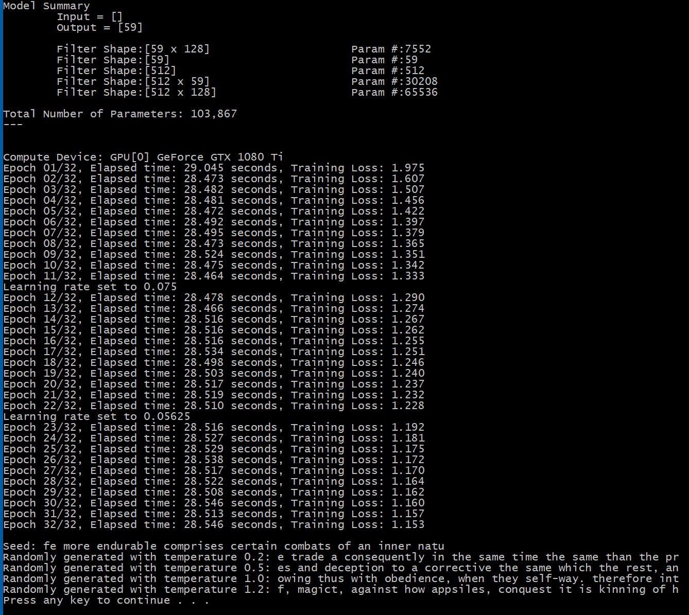

# Text Generation with LSTM

The original Python code can be found in [ch8-1.py](../../Python/ch8-1.py)

In this project, we'll learn a language model, and use it to generate text. 

We start from the text in https://s3.amazonaws.com/text-datasets/nietzsche.txt, and download it with
```
void init_text() {
  var url = "https://s3.amazonaws.com/text-datasets/nietzsche.txt";
  var text_path = Util.fullpathForDownloadedFile("text-datasets", "nietzsche.txt");
  if (System.IO.File.Exists(text_path) == false) {
    var success = FromStackOverflow.FileDownloader.DownloadFile(url, text_path, timeoutInMilliSec: 360000);
    if (!success) {
      Console.WriteLine("Could not download " + url);
      return;
    }
  }
  text = System.IO.File.ReadAllText(text_path, Encoding.UTF8).ToLowerInvariant();
  Console.WriteLine("Corpus length:" + text.Length);       
}
```

Then, we take partially overlapping substrings of the text, and construct the training
data set `float[][] x`, `float[] y`, where the features `x` are substrings, and the labels `y` are
the characters immediately after each of those substrings. 

So, first we create the "sentences", in 
```
for (int i = 0; i < text.Length - maxlen; i += step) {
  sentences.Add(text.Substring(i, maxlen));
  next_chars.Add(text[maxlen + i]);
}
```

and fill in the features `x`, and the labels `y`

```
x = new float[sentences.Count][];
y = new float[sentences.Count];
for (int i = 0; i < sentences.Count; i++) {
  x[i] = new float[maxlen];
  var sentence = sentences[i];

  for (int t = 0; t < sentence.Length; t++) {
    x[i][t] = char_indices[sentence[t]];
  }
  y[i] = char_indices[next_chars[i]];
}
```

The language model will learns to predict the next character, given a sequence of previous characters. 

As in the previous chapters, we'll create the model in Python, and load it in C# for the
training. 

In Python we have (see [ch8-1.py](../../Python/ch8-1.py)):
```
def build_model_cntk(alphabet_size):
    x_placeholder = cntk.placeholder(shape=(), dynamic_axes=[cntk.Axis.default_batch_axis(), cntk.Axis.default_dynamic_axis()])
    model = cntk.one_hot(x_placeholder, num_classes=alphabet_size, sparse_output=True)
    model = cntk.layers.Recurrence(cntk.layers.LSTM(128))(model)
    model = cntk.sequence.last(model)
    model = cntk.layers.Dense(alphabet_size)(model)
    return model
```

and in C# we have: 
```
class TextGeneratingTrainingEngine: TrainingEngine {
  public CNTK.Function softmaxOutput;

  protected override void createVariables() {
    x = CNTK.Variable.InputVariable(new CNTK.NDShape(0), CNTK.DataType.Float, name: "x");
    var y_axis = new List<CNTK.Axis>() { CNTK.Axis.DefaultBatchAxis() };
    y = CNTK.Variable.InputVariable(new CNTK.NDShape(0), CNTK.DataType.Float, dynamicAxes: y_axis, name: "y");
  }

  protected override void createModel() {
    var model_path = "ch8-1_cntk.model";
    model = CNTK.Function.Load(model_path, computeDevice);
    var replacements = new CNTK.UnorderedMapVariableVariable() { { model.Placeholders()[0], x } };
    model.ReplacePlaceholders(replacements);
    softmaxOutput = CNTK.CNTKLib.Softmax(model.Output);
  }

  protected override CNTK.Function custom_loss_function() {
    var y_oneHot = CNTK.CNTKLib.OneHotOp(y, (uint)alphabet_size, false, new CNTK.Axis(0));
    var rtrn = CNTK.CNTKLib.CrossEntropyWithSoftmax(model.Output, y_oneHot);
    return rtrn;
  }
}
```

Then, we proceed with the training as before. 

Let's see now how we can generate text based on the model that we have trained. 

The idea is that we start from a random substring of the original text: 
```
var start_index = (int)(random.NextDouble() * (di.text.Length - maxlen - 1));
var seed_generated_text = di.text.Substring(start_index, maxlen).Replace('\n', ' ');
Console.WriteLine($"\nSeed: {seed_generated_text}");
```

Then, we pass it through the trained model, and we obtain a vector (the softmax output) with
the estimated probabilities of the next character. We adjust these probabilities with a "temperature", 
draw a random character based on this distribution, append it to the end of the substring, and 
keep on doing it for a number of iterations:
```
for (int i=0; i<400; i++) {
  var sampled = generated_text.Select(v => (float)(di.char_indices[v])).ToArray();
  var preds = engine.evaluate(new float[][] { sampled }, engine.softmaxOutput)[0].Take(di.chars.Length).ToArray();
  var next_index = sample(random, preds, temperature);
  var next_char = di.chars[next_index];
  if ( next_char=='\n' ) { next_char = ' '; }
  generated_text = generated_text.Substring(1) + next_char;
}
Console.WriteLine($"Randomly generated with temperature {temperature:F1}: {generated_text}");
```

This is how it looks like. 




