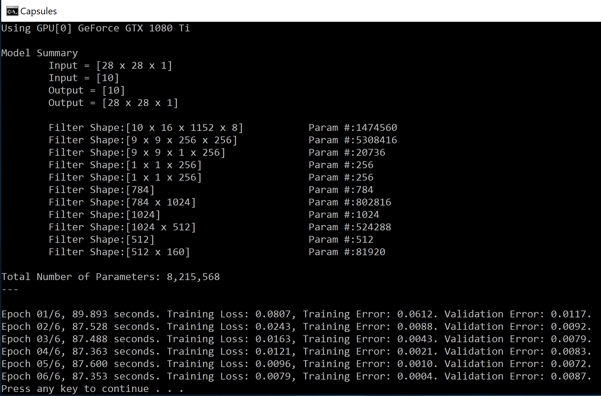
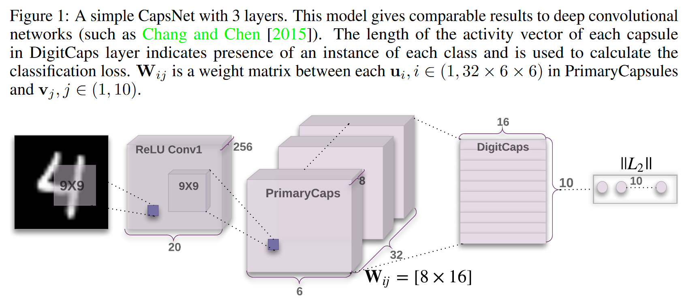
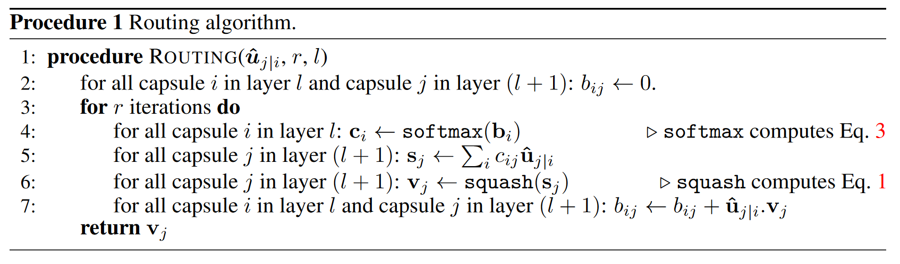
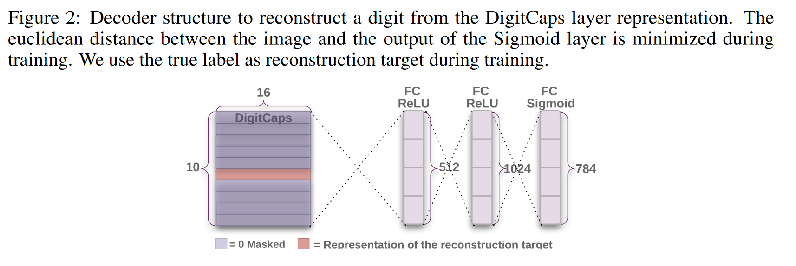
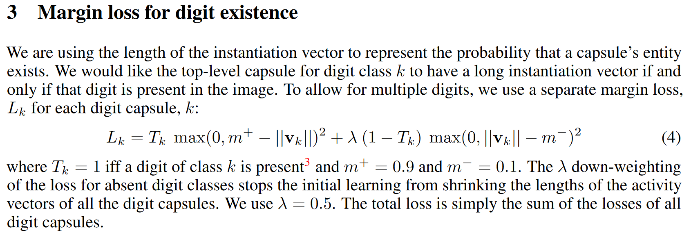

# Dynamic Routing With Capsules

There are many Python implementations of the paper
"Dynamic Routing Between Capsules"  by Sara Sabour, 
Nicholas Frosst, and Geoffrey E Hinton. 
(https://arxiv.org/abs/1710.09829). Some of them are:  

* https://github.com/Sarasra/models/tree/master/research/capsules, which
is the official TensorFlow implementation by the first author of the paper.

* https://github.com/XifengGuo/CapsNet-Keras, a nicely-written port in Keras
(the project also has links to other implementations in other frameworks).

* https://github.com/southworkscom/CapsNet-CNTK, a nicely-written
port using the CNTK Python API. 

Herein let's qo quickly over our C# implementation.  First, this 
is how the training looks like: 



With no augmentations, within a few minutes, we get to 99.3% accuracy. 

Borrowing a figure from the original paper, the network architecture is:

 

This is implemented as follows: 

```
  imageVariable = Util.inputVariable(input_shape, "image");
  var conv1 = Layers.Convolution2D(
    imageVariable, 256, new int[] { 9, 9 }, computeDevice, 
    use_padding: false, activation: CC.ReLU, name: "conv1");

  var primarycaps = create_primary_cap(
    conv1, dim_capsule: 8, n_channels: 32, 
    kernel_size: new int[] { 9, 9 }, strides: new int[] { 2, 2 }, pad: false);

  var digitcaps = create_capsule_layer(
    primarycaps, num_capsule: 10, dim_capsule: 16, 
    routings: routings, name: "digitcaps");

  var out_caps = get_length_and_remove_last_dimension(digitcaps, name: "capsnet");

```

So, we start from a 28x28x1 tensor, which is the standard MNIST shape. 

This goes through the `conv1` layer to produce a 20x20x256 tensor.   

The "PrimaryCaps" block pass it though another Conv2D layer to
produce a 6x6x256 tensor, it reshapes it to 1152x8 and finally "squashes" it
along the last dimension. This 1152x8 tensor is thought of as 
1152 capsules of length 8. 

Then, the "DigitCaps" will take the 1152x8 tensor, and finally produce
10 capsules of length 16 (a 10x16 tensor) in two steps: 

1. It will multiply (with broadcasting ) the 1152x8 tensor with 
a weight matrix W which is 10x16x1152x8. 

2. It will implement the "dynamic routing" step. 

In the original paper, the dynamic routing is described as: 



In C#, this is implemented as:

```
  C.Function outputs = null;
  var zeros = new C.Constant(new int[] { num_capsule, 1, input_num_capsule }, C.DataType.Float, 0, computeDevice);
  var b = CC.Combine(new C.VariableVector() { zeros });
  for (int i = 0; i < routings; i++) {
    var c = CC.Softmax(b, new C.Axis(0));
    var batch_dot_result = CC.ElementTimes(c, inputs_hat);
    batch_dot_result = CC.ReduceSum(batch_dot_result, new C.Axis(2));
    batch_dot_result = CC.Squeeze(batch_dot_result);
    outputs = squash(batch_dot_result, name: $"squashed_{i}", axis: 1);
    if (i < (routings - 1)) {
      outputs = CC.Reshape(outputs, new int[] { num_capsule, dim_capsule, 1 });
      batch_dot_result = CC.ElementTimes(outputs, inputs_hat);
      batch_dot_result = CC.ReduceSum(batch_dot_result, new C.Axis(1));
      b = CC.Plus(b, batch_dot_result);
    }
  }
``` 

Finally, the output of the digit capsules is used as part of an 
autoencoder which will finally produce a 28x28x1 reconstructed image. 
This is done in: 



with the straightforward C# implementation: 

```
C.Function create_decoder(int[] digits_capsules_output_shape) {
  var decoder_input = Util.inputVariable(digits_capsules_output_shape);
  var decoder = Layers.Dense(decoder_input, 512, computeDevice, activation: CC.ReLU);
  decoder = Layers.Dense(decoder, 1024, computeDevice, activation: CC.ReLU);
  decoder = Layers.Dense(decoder, Util.np_prod(input_shape), computeDevice, activation: CC.Sigmoid);
  decoder = CC.Reshape(decoder, input_shape, name: "out_recon");
  return decoder;
}
```

As a final note, in the paper the custom loss function is given by the formula: 



In C# we need to be slightly verbose: 

```
  var y_true = categoricalLabel;
  var y_pred = out_caps;
  var digit_loss = CC.Plus(
    CC.ElementTimes(y_true, CC.Square(CC.ElementMax(DC(0), CC.Minus(DC(0.9), y_pred), ""))),
    CC.ElementTimes(DC(0.5), 
    CC.ElementTimes(CC.Minus(DC(1), y_true), CC.Square(CC.ElementMax(DC(0), CC.Minus(y_pred, DC(0.1)), "")))));
  digit_loss = CC.ReduceSum(digit_loss, C.Axis.AllStaticAxes());
```
  
And that's basically it.     
